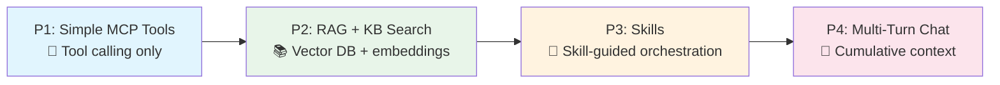
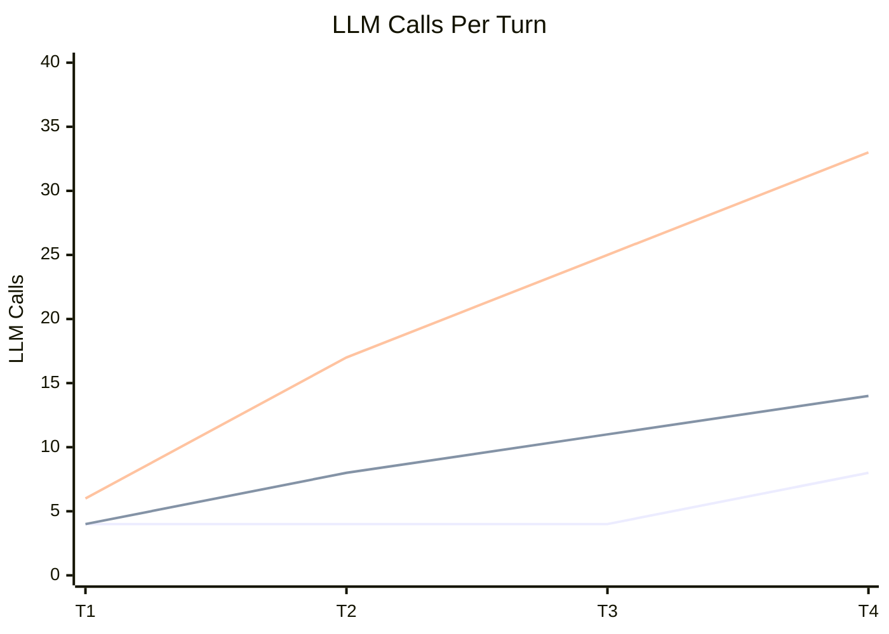
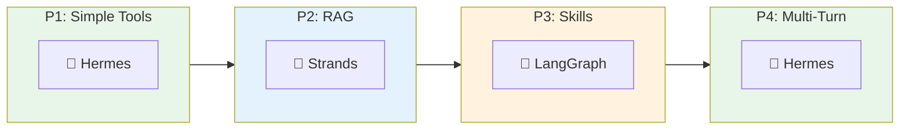
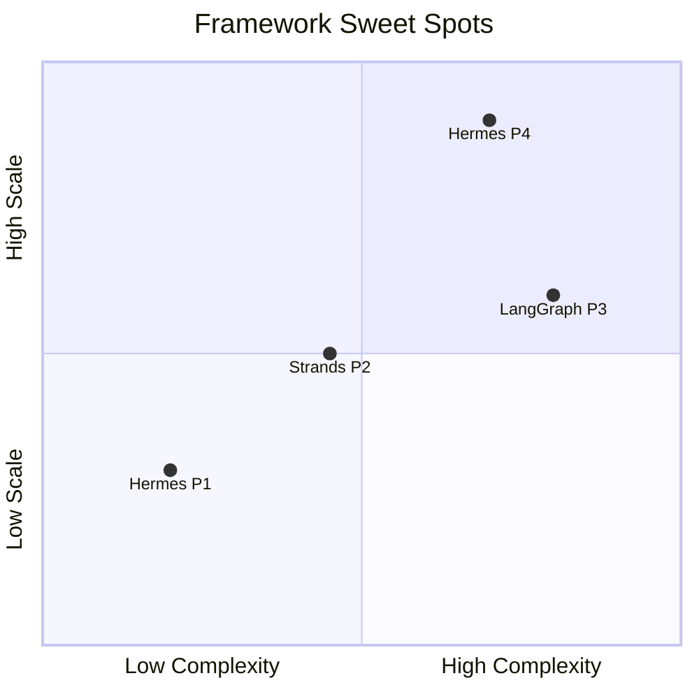

# Agentic Framework Evaluation Report

### LangGraph vs AWS Strands Agents vs Hermes

### 4 Patterns · 3 Frameworks · 40+ Experiments

> **Core Question**: *Which framework should you use — and when?*
>
> **Alt Question**: *If you're building a custom framework, what's the best feature to borrow from each?*

| Detail        | Value                                                                  |
| ------------- | ---------------------------------------------------------------------- |
| Model         | `qwen3.5:35b-a3b-coding-nvfp4` (local Ollama — identical across all 3) |
| Tool Protocol | MCP (Model Context Protocol)                                           |
| Eval Date     | June 2026                                                              |

***

## Executive Summary

**There is no universal winner.** The right framework is pattern-dependent:

| If you need...                | Use...        | Why                                                  |
| ----------------------------- | ------------- | ---------------------------------------------------- |
| Simple tool orchestration     | **Hermes**    | Fastest, lightest (9.5s, 49 MB, 267 deps)            |
| RAG-powered search            | **Strands**   | Lowest memory (44 MB), fastest RAG latency           |
| Complex multi-skill workflows | **LangGraph** | 100% accuracy, best multi-skill orchestration        |
| Multi-turn chatbot            | **Hermes**    | Lowest LLM call growth (2×) — calls scale with task complexity, not context depth |

| Framework     | Gold Medals (🥇) | Silver (🥈) |   Bronze (🥉)  |
| ------------- | :--------------: | :---------: | :------------: |
| **Hermes**    |  **2** (P1, P4)  |  2 (P2, P3) |        0       |
| **LangGraph** |    **1** (P3)    |  2 (P1, P4) |     1 (P2)     |
| **Strands**   |    **1** (P2)    |      0      | 3 (P1, P3, P4) |

 

***

## What We Tested

### Frameworks

| Framework              | Language | Architecture                              | Key Characteristic                             |
| ---------------------- | -------- | ----------------------------------------- | ---------------------------------------------- |
| **LangGraph**          | Python   | Graph-based state machine                 | Nodes → edges → conditional routing            |
| **AWS Strands Agents** | Python   | AWS-native agent SDK                      | MCP subprocess isolation, event-driven         |
| **Hermes**             | Python   | Custom agent (evolved during experiments) | Fixed orchestration loop, `uv`-based packaging |

### Patterns (Progressive Complexity)



| Pattern                 | What It Tests                             | Key Challenge                                                 |
| ----------------------- | ----------------------------------------- | ------------------------------------------------------------- |
| **P1** Simple MCP Tools | Basic tool calling + answer synthesis     | Can the agent call tools and synthesize a coherent answer?    |
| **P2** RAG + KB Search  | Vector DB retrieval + knowledge grounding | Can the agent combine structured + unstructured knowledge?    |
| **P3** Skills           | Skill-guided multi-tool orchestration     | Can the agent choose the right skill and follow its workflow? |
| **P4** Multi-Turn Chat  | Cumulative conversation context           | How does cost scale with conversation depth?                  |

 

***

## Metrics We Measured

### Core Metrics

| Metric             | Unit  | What It Tells You                       |
| ------------------ | ----- | --------------------------------------- |
| **Latency**        | ms    | End-to-end wall-clock time per request  |
| **Total Tokens**   | count | Prompt + completion tokens (cost proxy) |
| **Packaging Size** | MB    | Installed framework + all dependencies  |

### Extended Metrics

| Metric                | Unit      | What It Tells You                            |
| --------------------- | --------- | -------------------------------------------- |
| **LLM Calls**         | count     | Number of model invocations per request      |
| **Tool Calls**        | count     | Number of MCP tool invocations per request   |
| **Skill Activations** | count     | Skill templates loaded (P3/P4 only)          |
| **Peak Memory**       | MB        | Maximum RAM during execution                 |
| **Cold Start**        | ms        | First-request overhead (loading models, DBs) |
| **Dependency Count**  | count     | Total pip packages installed                 |
| **Answer Quality**    | pass/fail | Factual accuracy + formatting + completeness |

 

***

## Pattern 1: Simple MCP Tools

*Can the agent call tools and synthesize a coherent answer?*

| Metric         |    LangGraph   |   Strands   |    Hermes    |     🏆    |
| -------------- | :------------: | :---------: | :----------: | :-------: |
| Avg Latency    |    12,400 ms   |  11,453 ms  | **9,468 ms** |   Hermes  |
| Avg Tokens     |      3,140     |    3,559    |   **3,092**  |   Hermes  |
| Peak Memory    |     58.6 MB    | **41.1 MB** |    51.1 MB   |  Strands  |
| Packaging      |     76.9 MB    |   72.8 MB   |  **49.3 MB** |   Hermes  |
| Dependencies   |       175      |     142     |    **101**   |   Hermes  |
| Answer Quality | **100%** (4/4) |  50% (2/4)  |   75% (3/4)  | LangGraph |

**🏆 Winner: Hermes** — fastest, lightest packaging, fewest dependencies.

> ⚠️ Strands returned raw tool output in 2/4 experiments. LangGraph was the only framework with perfect answer quality in P1. 

***

## Pattern 2: RAG + Knowledge Base Search

*Can the agent combine structured data with vector-retrieved knowledge?*

| Metric         | LangGraph |    Strands    |    Hermes    |     🏆    |
| -------------- | :-------: | :-----------: | :----------: | :-------: |
| Avg Latency    | 31,758 ms | **29,396 ms** |   32,849 ms  |  Strands  |
| Avg Tokens     | **2,627** |     3,688     |     2,898    | LangGraph |
| Peak Memory    |  133.6 MB |  **44.0 MB**  |    54.2 MB   |  Strands  |
| Packaging      |  984.8 MB |    996.8 MB   | **967.2 MB** |   Hermes  |
| Answer Quality |    100%   |      100%     |     100%     |    Tie    |

**🏆 Winner: Strands** — fastest latency + lowest memory (44 MB vs 134 MB LangGraph).

> The RAG stack added \~900 MB to all frameworks. Strands' **MCP subprocess isolation** kept its memory at 44 MB by running embeddings in a separate process. LangGraph loaded everything **in-process** → 134 MB. 

***

## Pattern 3: Agent with Skills

*Can the agent choose the right skill and follow its guided workflow?*

| Metric                |    LangGraph    |     Strands     |         Hermes        |      🏆      |
| --------------------- | :-------------: | :-------------: | :-------------------: | :----------: |
| Avg Latency           |    40,093 ms    |  **34,684 ms**  |       37,915 ms       |    Strands   |
| Avg Tokens            |      9,499      |      14,154     |       **8,031**       |    Hermes    |
| Peak Memory           |     134.6 MB    |   **45.6 MB**   |        54.4 MB        |    Strands   |
| **Factual Accuracy**  |  **100%** (4/4) |  **100%** (4/4) |     **75%** (3/4)     | LG / Strands |
| **Skill Utilization** | **5/5** correct | **5/5** correct | **4/5** (wrong skill) | LG / Strands |

**🏆 Winner: LangGraph** — 100% factual accuracy, correct multi-skill orchestration.

> Hermes chose the **wrong skill** for the European GDP question, causing it to **miss Russia** — factual error (14.98T instead of 17.05T). Strands self-corrected name lookup failures (`UK`→`United Kingdom`). 

***

## Pattern 4: Multi-Turn Conversational Agent


_How does cost scale as conversation history accumulates?_

| Metric                           |  LangGraph  |      Strands       |            Hermes            |    🏆     |
| -------------------------------- | :---------: | :----------------: | :--------------------------: | :-------: |
| LLM Call Growth (T1→T4)          | 4→14 (3.5×) |    6→33 (5.5×)     |       **4→8 (2×)**           |  Hermes   |
| Token Growth (T1→T3)             |    4.6×     |        8.4×        |           **2.6×**           |  Hermes   |
| T2-T4 Avg Latency                |    62.8s    |     **24.5s**      |            28.0s             |  Strands  |
| Context Test ("Same for Brazil") |   ✅ Pass    | ⚠️ Partial (3-way) | ❌ **Fail** (Brazil vs Japan) | LangGraph |
| Error Recovery (T4)              |      —      |         —          |    ✅ Russia→Russian Fed.     |  Hermes   |

**🏆 Winner: Hermes** — lowest LLM call growth (2×) + most token-efficient T1→T3 (2.6× vs Strands 8.4×).

> ⚠️ **v3 Correction**: Hermes failed the context test (compared Brazil vs Japan, dropping India). **Only LangGraph** correctly inferred "Same for Brazil" = India vs Brazil. Hermes excels at **stateless** turns but not **context-dependent follow-ups**.

---

Four changes from v2:

1. **Token Growth row** now covers T1→T4 for all three frameworks (Hermes T4: 45,370 tokens, 7.0×)
2. **Context Test**: Hermes flipped from ✅ Pass → ❌ Fail, winner changed from `LG / Hermes` → `LangGraph` alone
3. **Hermes T4 data corrected**: LLM Calls 3→**8**, Tool Calls 11→**19**, Total Tokens N/A→**45,370**, Latency 56,018ms→**35,664ms**
4. **T2-T4 Avg Latency**: Hermes updated to **28.0s** (was 34.8s with stale T4 latency)

**🏆 Winner: Hermes** — lowest LLM call growth (2×) is the standout finding.



 

***

## Cross-Pattern Winner Evolution



|            |  P1: Tools |   P2: RAG   |   P3: Skills  |  P4: Chat  | Trend                                             |
| ---------- | :--------: | :---------: | :-----------: | :--------: | ------------------------------------------------- |
| 🥇         | **Hermes** | **Strands** | **LangGraph** | **Hermes** | Each framework wins where its architecture shines |
| 🥈         |  LangGraph |    Hermes   |     Hermes    |  LangGraph | LangGraph rises with complexity                   |
| 🥉         |   Strands  |  LangGraph  |    Strands    |   Strands  | Strands excels in RAG, struggles elsewhere        |
| Key Metric |    Speed   |    Memory   |    Accuracy   |   Scaling  | Different metrics dominate each pattern           |

 

***

## Finding 1: There Is No Universal Winner

Every framework won at least one pattern. The winner depends on your **use case complexity**.



> **Takeaway**: Don't pick a framework based on benchmarks — pick it based on **which pattern matches your workload**. 

***

## Finding 2: Memory Architecture Matters More Than You Think

Adding RAG (P1→P2) inflated packaging from \~70 MB to \~970 MB. But **peak memory** told a different story:

| Framework     | P1 Memory |   P2 Memory  | P1→P2 Growth | Architecture             |
| ------------- | :-------: | :----------: | :----------: | ------------------------ |
| **LangGraph** |  58.6 MB  | **133.6 MB** |   **2.3×**   | In-process embeddings    |
| **Strands**   |  41.1 MB  |  **44.0 MB** |   **1.07×**  | MCP subprocess isolation |
| **Hermes**    |  51.1 MB  |  **54.2 MB** |   **1.06×**  | MCP subprocess isolation |

> **Takeaway**: Strands/Hermes run MCP tools in **subprocess isolation** — the embedding model's 80+ MB lives in a child process. LangGraph loads everything in-process. If you're running multiple agents, this 3× difference adds up fast.
>
> 🔧 **Borrow this**: **Always run heavy models (embeddings, rerankers) in MCP subprocesses**, not in the agent process. 

***

## Finding 3: LLM Call Scaling Reveals Architecture

Pattern 4 exposed **fundamental architectural differences**:

| Framework     |  LLM Calls: T1 → T4   |      Big-O      | What Happens at 20 Turns?                        |
| ------------- | :-------------------: | :-------------: | ------------------------------------------------ |
| **Hermes**    |  4 → 4 → 4 → **8** †  |  **~O(1)** †    | ~4–8 calls/turn (bounded by task, not context)   |
| **LangGraph** |  4 → 8 → 11 → **14** |    **O(n)**     | ~70 calls (growing but manageable)               |
| **Strands**   | 6 → 17 → 25 → **33** | **O(n) steep**  | ~165 calls (unsustainable)                       |

> † Hermes T4 jumped to 8 calls because the question required probing 5 European country names before finding Russia. This is **task complexity**, not a context-growth effect — standard turns remain at ~4 calls regardless of conversation depth.

| Architecture                        | Pattern                     | Why                                      |
| ----------------------------------- | --------------------------- | ---------------------------------------- |
| **Fixed loop** (Hermes)             | Plan once → Execute → Done  | Doesn't re-reason on accumulated context |
| **Graph state machine** (LangGraph) | Re-evaluate at each node    | Each node sees growing history           |
| **Full context replay** (Strands)   | Replay everything each call | Every LLM invocation gets full history   |

> 🔧 **Borrow this**: Hermes's fixed orchestration loop. For chatbots, **don't let LLM calls scale with conversation length**. 

***

## Finding 4: Skills Changed Orchestration Quality, Not Overhead

Adding skills (P2→P3) had **zero impact** on packaging, memory, or cold start:

| Metric         | P2 → P3 Change (avg across frameworks) |
| -------------- | :------------------------------------: |
| Packaging Size |          **< 1 MB** difference         |
| Peak Memory    |          **< 1 MB** difference         |
| Cold Start     |        **No measurable change**        |

But skills **dramatically changed orchestration quality**:

| Framework     | Correct Skill Selection | Factual Accuracy |     Multi-Skill Awareness    |
| ------------- | :---------------------: | :--------------: | :--------------------------: |
| **LangGraph** |        **5/5** ✅        |     **100%**     |  ✅ 2 skills on complex tasks |
| **Strands**   |        **5/5** ✅        |     **100%**     |  ✅ 2 skills on complex tasks |
| **Hermes**    |        **4/5** ⚠️       |      **75%**     | ❌ Missed `report-formatting` |

> **Takeaway**: Skills are **free to add** (just markdown files!) but they separate frameworks that can correctly **select and compose skills** from those that can't.
>
> 🔧 **Borrow this**: LangGraph's skill routing. Build a **skill selection graph** that explicitly routes to the right skill based on intent classification. 

***

## Finding 5: Error Recovery Is a First-Class Differentiator

Across all patterns, **tools fail**. What matters is what happens next.

| Scenario                                   | Strands                            | Hermes                             | LangGraph             |
| ------------------------------------------ | ---------------------------------- | ---------------------------------- | --------------------- |
| P3: `country_lookup("UK")` → not found     | ✅ Retried → `"United Kingdom"`     | ❌ Never tried                      | (No failure)          |
| P3: `country_lookup("Russia")` → not found | ✅ Retried → `"Russian Federation"` | ❌ Missed entirely                  | (No failure)          |
| P4: `country_lookup("Russia")` → not found | (No failure)                       | ✅ Retried → `"Russian Federation"` | (No failure)          |
| **Recovery Rate**                          | **Excellent**                      | **Good** (P4 only)                 | **N/A** (no failures) |

> Strands showed the **best error recovery** in P3. LangGraph **never triggered the failure** — it used full official names from the start. A valid strategy: **avoid errors > recover from errors**.
>
> 🔧 **Borrow this**: Strands' retry mechanism. Build **automatic retry with name normalization** when tool calls return "not found." 

***

## Framework DNA: Best Feature to Borrow from Each

*If you're building a custom framework, steal these ideas:*

```mermaid
mindmap
  root((Custom<br/>Framework))
    LangGraph
      Graph-based skill routing
      Conditional edge logic
      Multi-skill composition
      Best token efficiency
    Strands
      MCP subprocess isolation
      Lowest memory footprint
      Automatic error retry
      Warm cache acceleration
    Hermes
      Fixed orchestration loop (~O(1))
      Lowest LLM call growth (2×)
      Lightest packaging
      Emoji-rich formatting
```

| Borrow From   | Feature                      | Why It Matters                                                  |
| ------------- | ---------------------------- | --------------------------------------------------------------- |
| **LangGraph** | Graph-based skill routing    | Best multi-skill composition; highest accuracy on complex tasks |
| **LangGraph** | Token-efficient context mgmt | 6.7× growth in P4 vs 12.5× Strands — saves cost at scale        |
| **Strands**   | MCP subprocess isolation     | 3× less memory than in-process; essential for multi-agent       |
| **Strands**   | Tool-call error retry        | Self-healing when tools return unexpected results               |
| **Strands**   | Warm cache acceleration      | Latency *decreases* across multi-turn (48s→18s)                 |
| **Hermes**    | Fixed orchestration loop     | Lowest LLM call growth (2×); calls bounded by task complexity, not context depth |
| **Hermes**    | Minimal dependency footprint | 267 deps vs 304-318; faster installs, smaller attack surface    |

 

***

## Decision Matrix: Which Framework When?

| Your Scenario                       | Recommended | Why                                        | Avoid                        |
| ----------------------------------- | ----------- | ------------------------------------------ | ---------------------------- |
| **Quick PoC / Hackathon**           | Hermes      | Fastest setup (49 MB), fewest deps (267)   | Strands (heavier setup)      |
| **RAG-heavy knowledge assistant**   | Strands     | Lowest memory (44 MB), fastest RAG latency | LangGraph (134 MB memory)    |
| **Complex analytical workflow**     | LangGraph   | 100% accuracy, multi-skill composition     | Hermes (may miss skills)     |
| **Production chatbot (10+ turns)**  | Hermes      | Lowest LLM call growth (2×), most predictable cost | Strands (33 LLM calls by T4) |
| **Memory-constrained edge deploy**  | Strands     | 44 MB peak memory (3× less than LG)        | LangGraph (135 MB)           |
| **Enterprise with strict accuracy** | LangGraph   | 100% accuracy across P1+P3                 | Hermes (75% in P1 and P3)    |
| **AWS-native infrastructure**       | Strands     | Native AWS SDK, Bedrock, Lambda            | Others (custom infra)        |

 

***

## Key Takeaways: Business Questions Answered

### Q: Which framework is fastest?

> **Depends on the pattern.** Hermes wins P1 (9.5s) and P4 (33.5s). Strands wins P2 (29.4s) and P3 (34.7s). LangGraph is never the fastest.

### Q: Which framework is cheapest to run (tokens)?

> **LangGraph** in single-turn (2,627 avg P2), **Hermes** in multi-turn (lowest growth, 2× vs LangGraph 6.7× and Strands 12.5×). **Strands is most expensive** — 123.6K tokens by Turn 4 in P4.

### Q: Which framework is most accurate?

> **LangGraph** — the only framework with **100% factual accuracy in both P1 and P3**. Hermes scored 75% in both.

### Q: Which framework scales best for chatbots?

> **Hermes** — lowest LLM call growth (4→8, 2×, across 4 turns). Standard turns stay at ~4 calls; harder ambiguous queries may spike to ~8. At 20 turns, Strands would use ~165 LLM calls per turn.

### Q: Which framework uses least memory?

> **Strands** — consistently 41-46 MB across all patterns. LangGraph is 3× higher (134 MB).

### Q: If I can only choose one framework for everything?

> **Hermes** — 2 gold medals, never last in accuracy, fastest in production patterns. But if accuracy is non-negotiable, **LangGraph**.

### Q: What's the single most important finding?

> **"Scale reveals architecture."** In single-turn patterns, all three perform comparably. Multi-turn exposes fundamental differences that determine production viability. **Test with at least 4-turn conversations before committing.**

 

***

*Report generated from 40+ experiments across 4 patterns, 3 frameworks, June 2026.*

***
