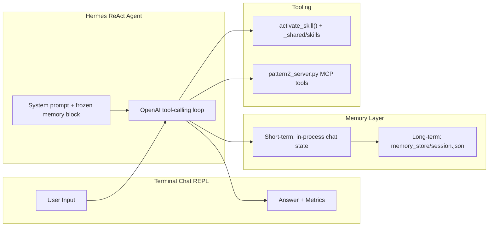

# Pattern 4: Agent with Memory and Chat

Hermes Pattern 4 adds an interactive chat REPL and two-tier conversation memory on top of Pattern 3.

## Architecture



## What It Does

The agent:

1. Reuses a live MCP session across chat turns.
2. Keeps short-term memory in the in-process conversation state.
3. Persists a structured long-term summary to `memory_store/session.json` after each turn.
4. Injects the frozen summary into the system prompt at session start.
5. Emits `logs.txt` entries that mirror the other Pattern 4 reference layouts.

## Usage

```bash
cd hermes/agents/4_agent_with_memory_and_chat
uv sync
uv run python -m src.main
```

Start with fresh memory:

```bash
uv run python -m src.main --reset
```

## Chat Commands

| Command | Description |
|---------|-------------|
| `quit` / `exit` / `q` | Exit and save the current session |
| `memory` | Display the persisted conversation summary |
| `clear` | Clear memory and restart the live session |

## File Layout

```text
4_agent_with_memory_and_chat/
├── memory_store/
│   └── session.json
├── src/
│   ├── __init__.py
│   ├── agent.py
│   ├── chat_ui.py
│   ├── main.py
│   ├── memory.py
│   ├── prompts.py
│   └── skill_tools.py
├── logs.txt
├── pyproject.toml
└── README.md
```

## Memory Model

- Short-term memory: the live Hermes session keeps the conversation state in memory across turns.
- Long-term memory: each turn writes a compact summary to `memory_store/session.json`.

## Notes

- MCP tools come from `_shared/src/mcp_servers/pattern2_server.py`.
- Skills come from `_shared/skills`.
- The agent still uses `HermesAgent`, `quiet_mode=True`, `skip_memory=False`, and `skip_context_files=True`.

