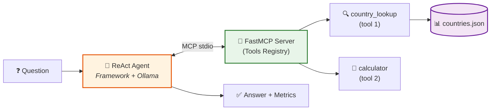

## First Goal: Create Pattern 1 


Create a Hermes Codebase that does exactly like Strands/Langgraph (in terms of logs.txt) but incorporates the standard pracrtices of hermes library

to design pattern 1 

Read the docs thoroughly: 




Output folder: hermes/agents/1_agent_with_multiple_mcp_tools

Inspiration from: 
- langgraph/agents/1_agent_with_multiple_mcp_tools
- strands/agents/1_agent_with_multiple_mcp_tools


Necessary file/folder structure (Add more codebase if hermes wants it)

```
./langgraph/agents/1_agent_with_multiple_mcp_tools
├── README.md
├── experiments.bash
├── logs.txt
├── pyproject.toml
├── src
│   ├── __init__.py
│   ├── __pycache__
│   ├── agent.py
│   ├── main.py
│   └── prompts.py
└── uv.lock
```

---
