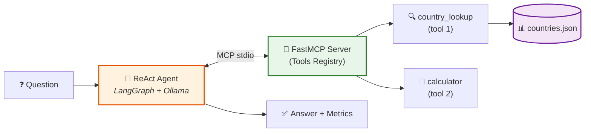
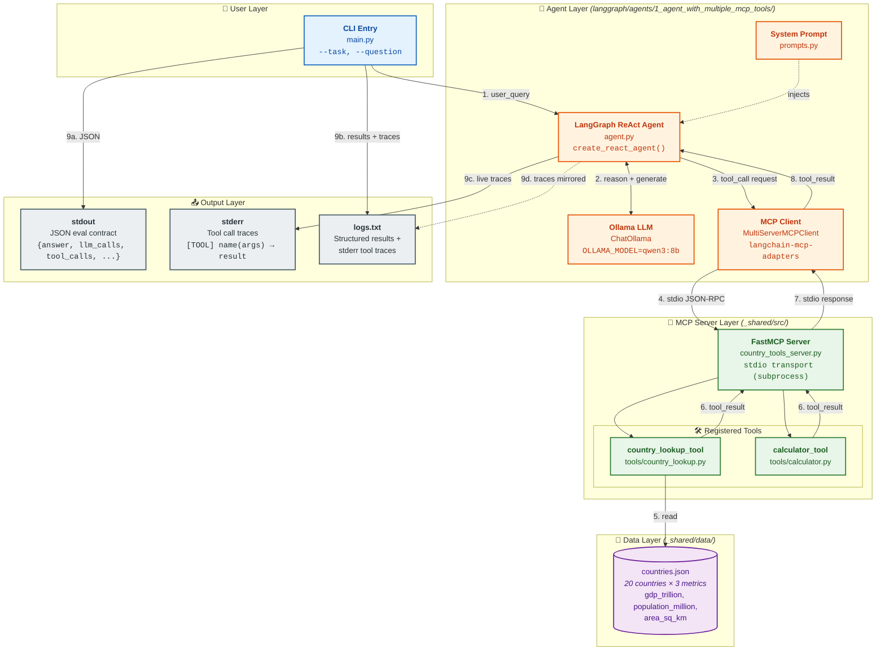
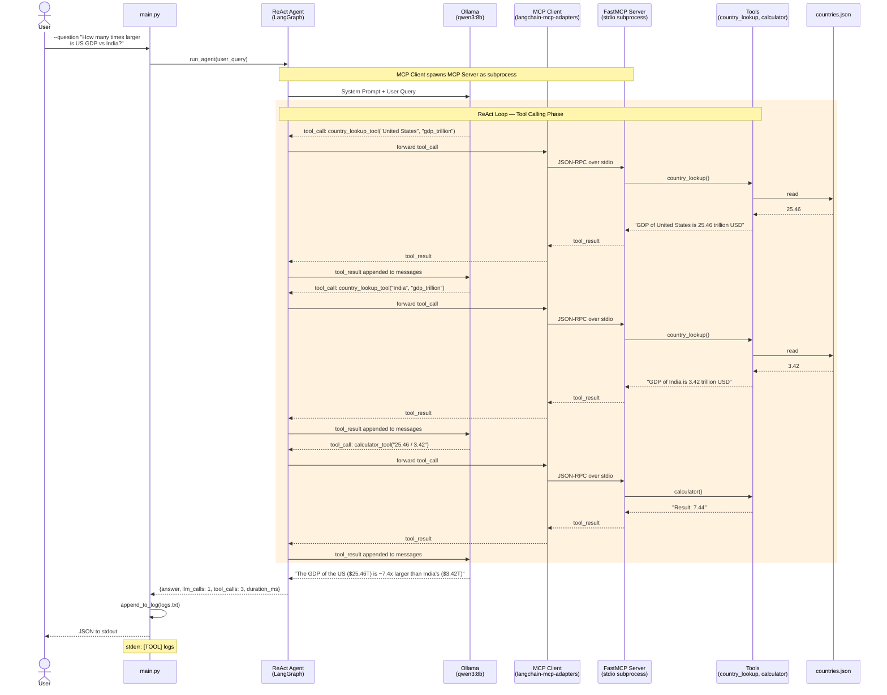

## Simplified System Design Diagram for the Augmented LLM (LLM with Tool Use)

```mermaid

graph LR
    Q["❓ Question"] --> A["🤖 ReAct Agent<br/><i>LangGraph + Ollama</i>"]
    A <-->|"MCP stdio"| S["🔌 FastMCP Server\n(Tools Registry)"]
    S --> T1["🔍 country_lookup\n(tool 1)"]
    S --> T2["🧮 calculator\n(tool 2)"]
    T1 --> D[("📊 countries.json")]
    A --> R["✅ Answer + Metrics"]

    style A fill:#FFF3E0,stroke:#E65100,stroke-width:2px
    style S fill:#E8F5E9,stroke:#2E7D32,stroke-width:2px
    style D fill:#F3E5F5,stroke:#6A1B9A,stroke-width:2px

```

---

## Detailed System Design Diagram for the Augmented LLM (LLM with Tool Use)

```mermaid
graph TB
    subgraph USER_LAYER["🧑 User Layer"]
        CLI["<b>CLI Entry</b><br/>main.py<br/><code>--task, --question</code>"]
    end

    subgraph AGENT_LAYER["🤖 Agent Layer <i>(langgraph/agents/1_agent_with_multiple_mcp_tools/)</i>"]
        PROMPT["<b>System Prompt</b><br/>prompts.py"]
        AGENT["<b>LangGraph ReAct Agent</b><br/>agent.py<br/><code>create_react_agent()</code>"]
        LLM["<b>Ollama LLM</b><br/>ChatOllama<br/><code>OLLAMA_MODEL=qwen3:8b</code>"]
        MCP_CLIENT["<b>MCP Client</b><br/>MultiServerMCPClient<br/><code>langchain-mcp-adapters</code>"]
    end

    subgraph MCP_LAYER["🔌 MCP Server Layer <i>(_shared/src/)</i>"]
        direction TB
        MCP_SERVER["<b>FastMCP Server</b><br/>country_tools_server.py<br/><code>stdio transport (subprocess)</code>"]
        subgraph TOOLS["🛠️ Registered Tools"]
            LOOKUP["<b>country_lookup_tool</b><br/>tools/country_lookup.py"]
            CALC["<b>calculator_tool</b><br/>tools/calculator.py"]
        end
    end

    subgraph DATA_LAYER["💾 Data Layer <i>(_shared/data/)</i>"]
        JSON[("countries.json<br/><i>20 countries × 3 metrics</i><br/>gdp_trillion, population_million,<br/>area_sq_km")]
    end

    subgraph OUTPUT_LAYER["📤 Output Layer"]
        STDOUT["<b>stdout</b><br/>JSON eval contract<br/><code>{answer, llm_calls, tool_calls, ...}</code>"]
        STDERR["<b>stderr</b><br/>Tool call traces<br/><code>[TOOL] name(args) → result</code>"]
        LOGFILE["<b>logs.txt</b><br/>Structured results +<br/>stderr tool traces"]
    end

    %% Main flow
    CLI -->|"1. user_query"| AGENT
    PROMPT -.->|"injects"| AGENT
    AGENT <-->|"2. reason + generate"| LLM
    AGENT -->|"3. tool_call request"| MCP_CLIENT
    MCP_CLIENT -->|"4. stdio JSON-RPC"| MCP_SERVER
    MCP_SERVER --> LOOKUP
    MCP_SERVER --> CALC
    LOOKUP -->|"5. read"| JSON
    LOOKUP -->|"6. tool_result"| MCP_SERVER
    CALC -->|"6. tool_result"| MCP_SERVER
    MCP_SERVER -->|"7. stdio response"| MCP_CLIENT
    MCP_CLIENT -->|"8. tool_result"| AGENT

    %% Output flow
    CLI -->|"9a. JSON"| STDOUT
    CLI -->|"9b. results + traces"| LOGFILE
    AGENT -->|"9c. live traces"| STDERR
    AGENT -.->|"9d. traces mirrored"| LOGFILE

    %% Styling
    classDef userStyle fill:#E3F2FD,stroke:#1565C0,stroke-width:2px,color:#0D47A1
    classDef agentStyle fill:#FFF3E0,stroke:#E65100,stroke-width:2px,color:#BF360C
    classDef mcpStyle fill:#E8F5E9,stroke:#2E7D32,stroke-width:2px,color:#1B5E20
    classDef dataStyle fill:#F3E5F5,stroke:#6A1B9A,stroke-width:2px,color:#4A148C
    classDef outputStyle fill:#ECEFF1,stroke:#455A64,stroke-width:2px,color:#263238

    class CLI userStyle
    class PROMPT,AGENT,LLM,MCP_CLIENT agentStyle
    class MCP_SERVER,LOOKUP,CALC mcpStyle
    class JSON dataStyle
    class STDOUT,STDERR,LOGFILE outputStyle
```

---

## Sequence Diagram

```mermaid

sequenceDiagram
    actor User
    participant CLI as main.py
    participant Agent as ReAct Agent<br/>(LangGraph)
    participant LLM as Ollama<br/>(qwen3:8b)
    participant MCP_C as MCP Client<br/>(langchain-mcp-adapters)
    participant MCP_S as FastMCP Server<br/>(stdio subprocess)
    participant Tools as Tools<br/>(country_lookup, calculator)
    participant Data as countries.json

    User->>CLI: --question "How many times larger<br/>is US GDP vs India?"
    CLI->>Agent: run_agent(user_query)
    
    Note over Agent,MCP_S: MCP Client spawns MCP Server as subprocess

    Agent->>LLM: System Prompt + User Query
    
    rect rgb(255, 243, 224)
        Note over Agent,Tools: ReAct Loop — Tool Calling Phase
        
        LLM-->>Agent: tool_call: country_lookup_tool("United States", "gdp_trillion")
        Agent->>MCP_C: forward tool_call
        MCP_C->>MCP_S: JSON-RPC over stdio
        MCP_S->>Tools: country_lookup()
        Tools->>Data: read
        Data-->>Tools: 25.46
        Tools-->>MCP_S: "GDP of United States is 25.46 trillion USD"
        MCP_S-->>MCP_C: tool_result
        MCP_C-->>Agent: tool_result
        Agent->>LLM: tool_result appended to messages

        LLM-->>Agent: tool_call: country_lookup_tool("India", "gdp_trillion")
        Agent->>MCP_C: forward tool_call
        MCP_C->>MCP_S: JSON-RPC over stdio
        MCP_S->>Tools: country_lookup()
        Tools->>Data: read
        Data-->>Tools: 3.42
        Tools-->>MCP_S: "GDP of India is 3.42 trillion USD"
        MCP_S-->>MCP_C: tool_result
        MCP_C-->>Agent: tool_result
        Agent->>LLM: tool_result appended to messages

        LLM-->>Agent: tool_call: calculator_tool("25.46 / 3.42")
        Agent->>MCP_C: forward tool_call
        MCP_C->>MCP_S: JSON-RPC over stdio
        MCP_S->>Tools: calculator()
        Tools-->>MCP_S: "Result: 7.44"
        MCP_S-->>MCP_C: tool_result
        MCP_C-->>Agent: tool_result
        Agent->>LLM: tool_result appended to messages
    end

    LLM-->>Agent: "The GDP of the US ($25.46T) is ~7.4x larger than India's ($3.42T)"

    Agent-->>CLI: {answer, llm_calls: 1, tool_calls: 3, duration_ms}
    CLI->>CLI: append_to_log(logs.txt)
    CLI-->>User: JSON to stdout
    
    Note over CLI: stderr: [TOOL] logs
```