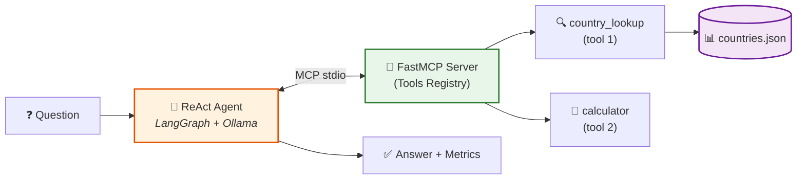
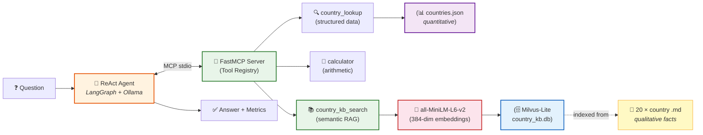
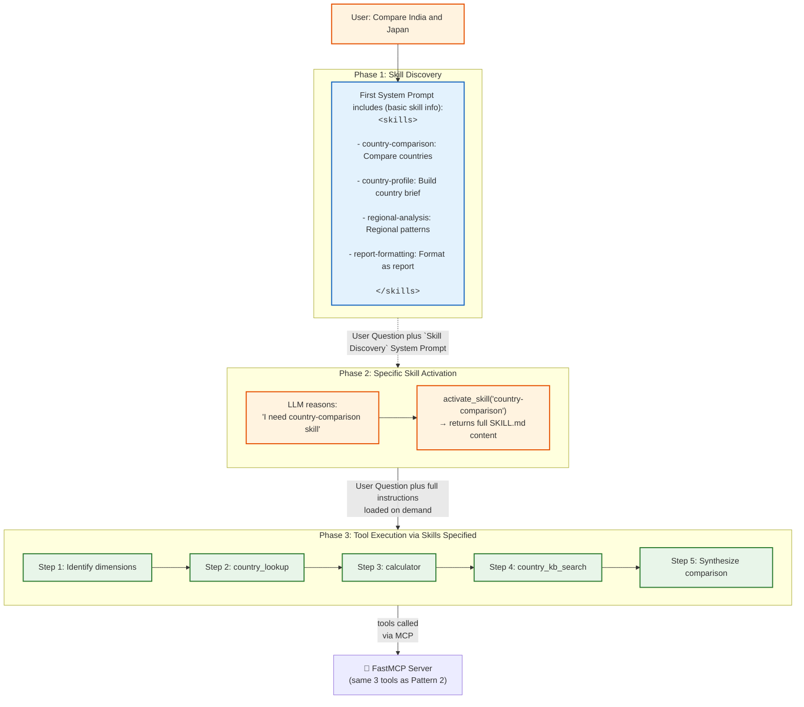
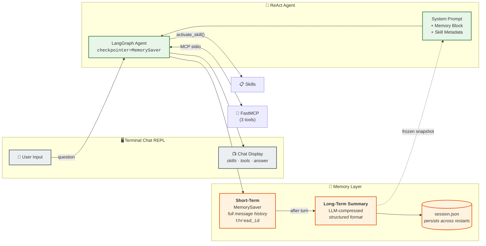
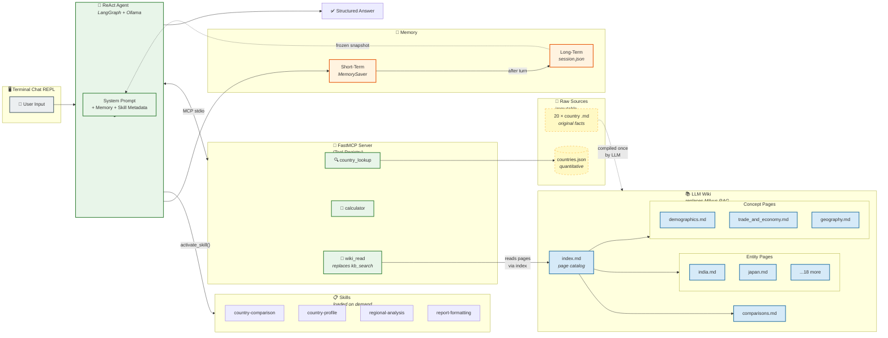
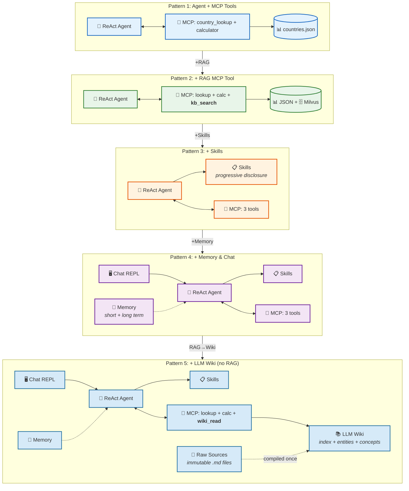

## 1_agent_with_mcp_tools

---

## 2_agent_with_rag_mcp_tool

---

### 3_agent_with_mcp_tools_and_skills

---

## 4_agent_with_memory_and_chat

---

## 5_agent_with_memory_and_chat_no_rag

---

## All 5 Patterns 

