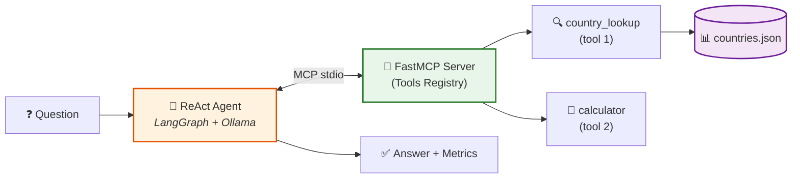
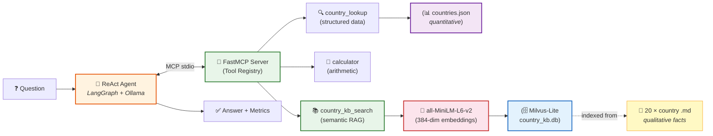
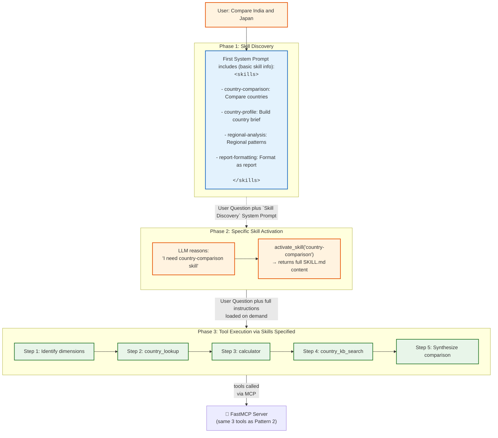

## 1_agent_with_mcp_tools

```mermaid
graph LR
    Q["❓ Question"] --> A["🤖 ReAct Agent<br/><i>LangGraph + Ollama</i>"]
    A <-->|"MCP stdio"| S["🔌 FastMCP Server\n(Tools Registry)"]
    S --> T1["🔍 country_lookup\n(tool 1)"]
    S --> T2["🧮 calculator\n(tool 2)"]
    T1 --> D[("📊 countries.json")]
    A --> R["✅ Answer + Metrics"]

    style A fill:#FFF3E0,stroke:#E65100,stroke-width:2px
    style S fill:#E8F5E9,stroke:#2E7D32,stroke-width:2px
    style D fill:#F3E5F5,stroke:#6A1B9A,stroke-width:2px
```

---

## 2_agent_with_rag_mcp_tool

```mermaid
graph LR
    Q["❓ Question"] --> A["🤖 ReAct Agent<br/><i>LangGraph + Ollama</i>"]
    A <-->|"MCP stdio"| S["🔌 FastMCP Server<br/>(Tool Registry)"]
    S --> T1["🔍 country_lookup<br/>(structured data)"]
    S --> T2["🧮 calculator<br/>(arithmetic)"]
    S --> T3["📚 country_kb_search<br/>(semantic RAG)"]
    T1 --> D1["(📊 countries.json<br/><i>quantitative</i>)"]
    T3 --> EMB["🧠 all-MiniLM-L6-v2<br/>(384-dim embeddings)"]
    EMB --> D2["(🗄️ Milvus-Lite<br/>country_kb.db)"]
    D2 -.->|"indexed from"| MD["📝 20 × country .md<br/><i>qualitative facts</i>"]
    A --> R["✅ Answer + Metrics"]

    style A fill:#FFF3E0,stroke:#E65100,stroke-width:2px
    style S fill:#E8F5E9,stroke:#2E7D32,stroke-width:2px
    style D1 fill:#F3E5F5,stroke:#6A1B9A,stroke-width:2px
    style D2 fill:#E3F2FD,stroke:#1565C0,stroke-width:2px
    style EMB fill:#FCE4EC,stroke:#C62828,stroke-width:2px
    style T3 fill:#E8F5E9,stroke:#2E7D32,stroke-width:2px,stroke-dasharray: 0
    style MD fill:#FFF9C4,stroke:#F9A825,stroke-width:1px
```

---

### 3_agent_with_mcp_tools_and_skills

```mermaid
graph TB
    Q["User: Compare India and Japan"]
    subgraph PHASE1["Phase 1: Skill Discovery"]
        SP["First System Prompt includes (basic skill info):<br/><code>&lt;skills&gt;</code><br/><br/>- country-comparison: Compare countries<br/><br/>- country-profile: Build country brief<br/><br/>- regional-analysis: Regional patterns<br/><br/>- report-formatting: Format as report<br/><br/><code>&lt;/skills&gt;</code>"]
    end
    Q --> SP

    subgraph PHASE2["Phase 2: Specific Skill Activation"]
        LLM1["LLM reasons:<br/>'I need country-comparison skill'"]
        LOAD["activate_skill('country-comparison')<br/>→ returns full SKILL.md content"]
        LLM1 --> LOAD
    end

    subgraph PHASE3["Phase 3: Tool Execution via Skills Specified"]
        direction LR
        STEP1["Step 1: Identify dimensions"]
        STEP2["Step 2: country_lookup"]
        STEP3["Step 3: calculator"]
        STEP4["Step 4: country_kb_search"]
        STEP5["Step 5: Synthesize comparison"]
        STEP1 --> STEP2 --> STEP3 --> STEP4 --> STEP5
    end

    PHASE1 -.->|"User Question plus `Skill Discovery` System Prompt"| PHASE2
    PHASE2 -->|"User Question plus full instructions<br/>loaded on demand"| PHASE3
    PHASE3 -->|"tools called<br/>via MCP"| MCP["🔌 FastMCP Server<br/>(same 3 tools as Pattern 2)"]

    classDef phase1 fill:#E3F2FD,stroke:#1565C0,stroke-width:2px
    classDef phase2 fill:#FFF3E0,stroke:#E65100,stroke-width:2px
    classDef phase3 fill:#E8F5E9,stroke:#2E7D32,stroke-width:2px

    class SP phase1
    class Q,LLM1,LOAD phase2
    class STEP1,STEP2,STEP3,STEP4,STEP5 phase3

```