# Building Effective Agents — Anthropic Blog

[original blog source](https://www.anthropic.com/engineering/building-effective-agents)

---

## What Are Agents?

Anthropic draws an important architectural distinction within _agentic systems_: 

- **Workflows** — Systems where LLMs and tools are orchestrated through **predefined code paths**.
- **Agents** — Systems where LLMs **dynamically direct their own processes** and tool usage, maintaining control over how they accomplish tasks.

---

## When (and When Not) to Use Agents

The recommendation is to find the **simplest solution possible**, and only increase complexity when needed. Agentic systems trade latency and cost for better task performance — you should consider when this tradeoff makes sense. 

- **Workflows** → predictability and consistency for well-defined tasks.
- **Agents** → flexibility and model-driven decision-making at scale.
- For many apps, **optimizing single LLM calls** with retrieval and in-context examples is enough.

---

## When and How to Use Frameworks

Frameworks (Claude Agent SDK, Strands Agents SDK, Rivet, Vellum, etc.) simplify low-level tasks but can create extra abstraction layers that obscure prompts/responses and make debugging harder. 

> **Recommendation**: Start by using LLM APIs directly. If you use a framework, ensure you understand the underlying code.

---

## Building Blocks, Workflows, and Agents

### 🧱 Building Block: The Augmented LLM

The foundational building block is an LLM enhanced with **retrieval**, **tools**, and **memory**. Current models can actively use these capabilities — generating search queries, selecting tools, and determining what information to retain. 

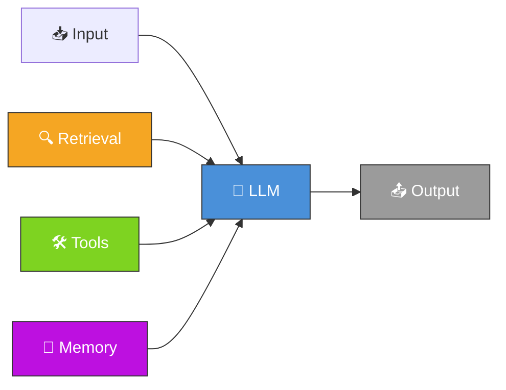
**Key implementation aspects:**

1. Tailor capabilities to your specific use case
2. Ensure an easy, well-documented interface for your LLM (e.g., via Model Context Protocol)

---

### ⛓️ Workflow: Prompt Chaining

Decomposes a task into a **sequence of steps**, where each LLM call processes the output of the previous one. Programmatic checks ("gates") can be added on intermediate steps to ensure the process stays on track. 

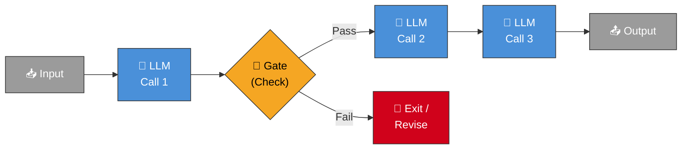

**When to use**: Tasks that can be easily decomposed into **fixed subtasks** — trading latency for higher accuracy.

**Examples**:

- Generate marketing copy → translate into a different language
- Write an outline → check criteria → write the document based on the outline

---

### 🔀 Workflow: Routing

Classifies an input and directs it to a **specialized follow-up task**. Allows separation of concerns and more specialized prompts. Without routing, optimizing for one kind of input can hurt performance on others. 

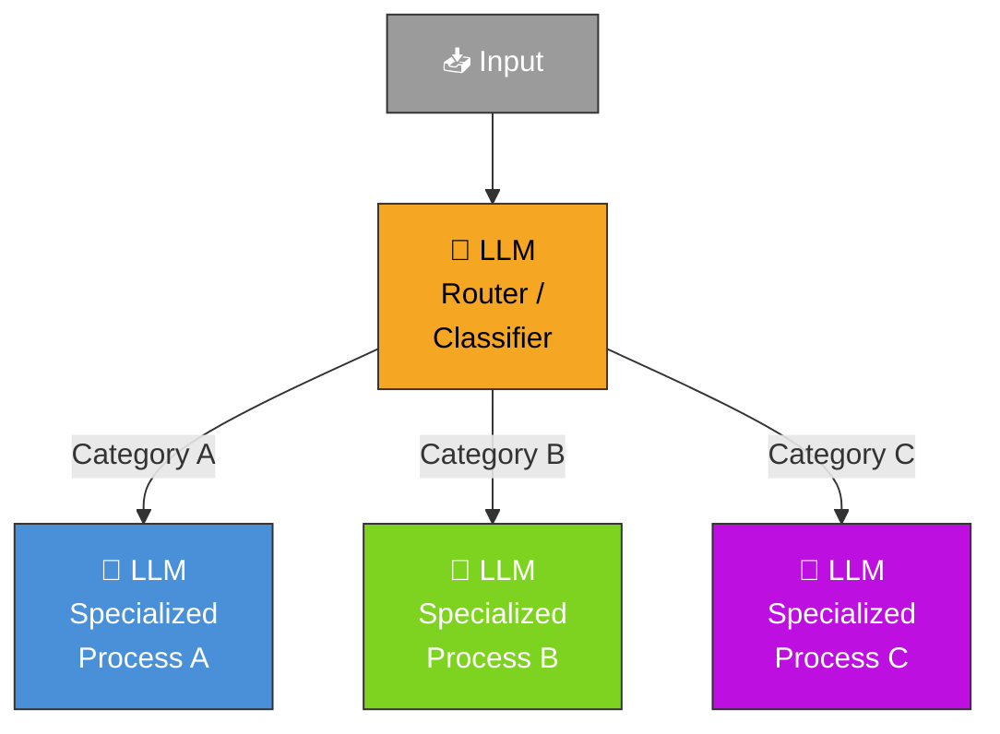

**When to use**: Complex tasks with **distinct categories** better handled separately, where classification can be done accurately.

**Examples**:

- Directing customer service queries (general, refund, technical) into different downstream processes
- Routing easy questions to smaller models (Claude Haiku 4.5) and hard questions to more capable models (Claude Sonnet 4.5)

---

### ⚡ Workflow: Parallelization

LLMs work **simultaneously** on a task and have their outputs aggregated programmatically. Two key variations: 

- **Sectioning** — Breaking a task into independent subtasks run in parallel
- **Voting** — Running the same task multiple times to get diverse outputs

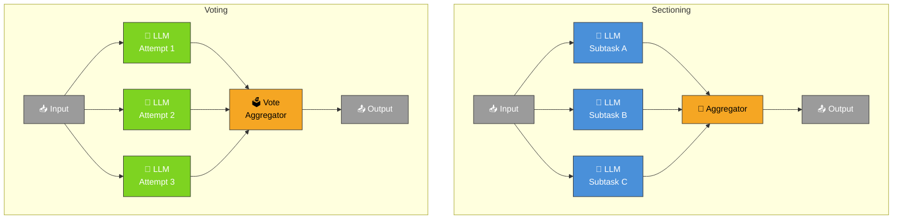

**When to use**: Subtasks can be parallelized for speed, or multiple perspectives are needed for higher confidence.

**Examples**:

- **Sectioning**: Guardrails (one model handles queries, another screens for inappropriate content); automated evals
- **Voting**: Code vulnerability review with multiple prompts; content moderation with different vote thresholds

---

### 🎼 Workflow: Orchestrator-Workers

A **central LLM dynamically breaks down tasks**, delegates them to worker LLMs, and synthesizes their results. Key difference from parallelization: subtasks are **not pre-defined** but determined by the orchestrator based on the specific input. 

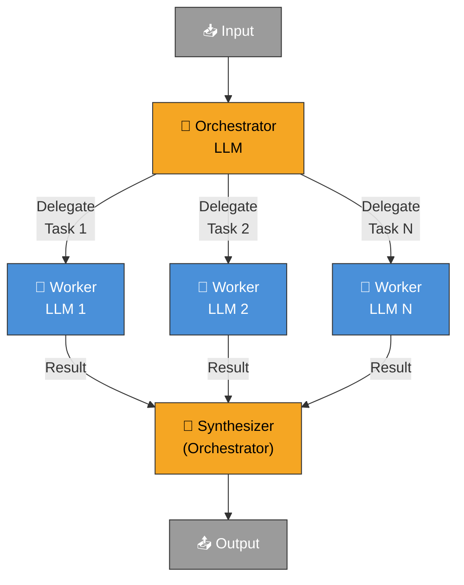

**When to use**: Complex tasks where you **can't predict** the subtasks needed.

**Examples**:

- Coding products that make complex changes to multiple files
- Search tasks gathering and analyzing information from multiple sources

---

### 🔄 Workflow: Evaluator-Optimizer

One LLM call **generates** a response while another **provides evaluation and feedback** in a loop. 

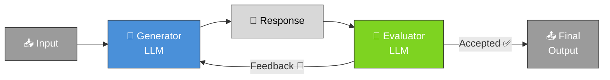

**When to use**: Clear evaluation criteria exist, and iterative refinement provides measurable value. Two signs of good fit: (1) LLM responses improve demonstrably with human-like feedback, (2) the LLM can provide such feedback. 

**Examples**:

- Literary translation where an evaluator LLM provides useful critiques
- Complex search tasks requiring multiple rounds of searching and analysis

---

### 🤖 Agents (Autonomous)

Agents begin with a command from (or interactive discussion with) the human user. Once the task is clear, they **plan and operate independently**, potentially returning to the human for further information or judgement. At each step, agents gain "ground truth" from the environment (tool call results, code execution) to assess progress. 

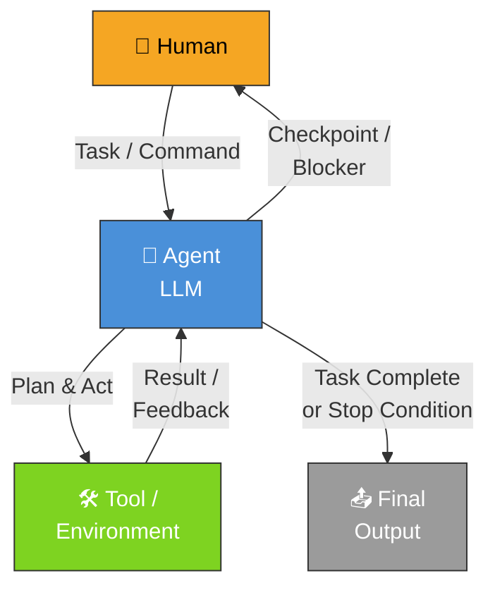

> Agents are typically just **LLMs using tools based on environmental feedback in a loop**. It is therefore crucial to design toolsets and their documentation clearly and thoughtfully.

**When to use**: Open-ended problems where you can't predict the number of steps or hardcode a fixed path. Requires trust in the LLM's decision-making. 

**Examples**:

- A coding agent to resolve SWE-bench tasks
- "Computer use" reference implementation where Claude uses a computer to accomplish tasks

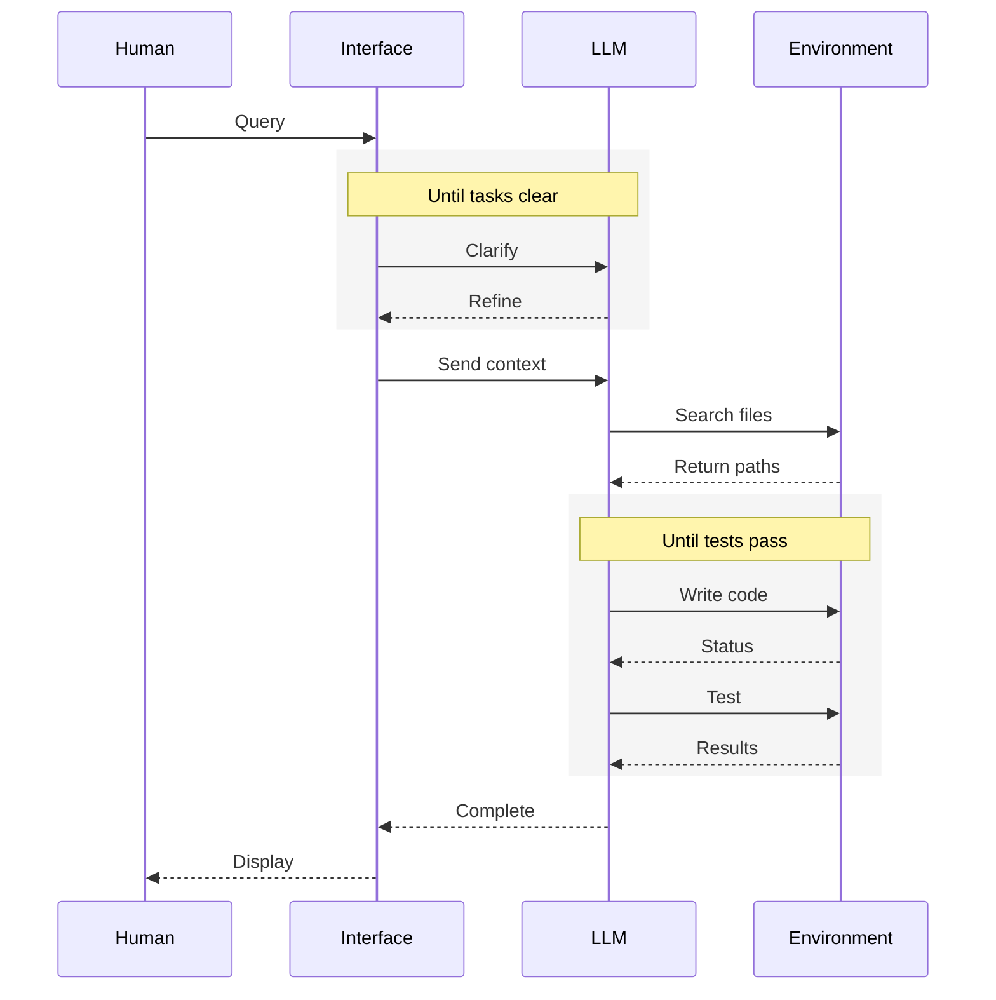

---

### 💻 High-Level Flow of a Coding Agent

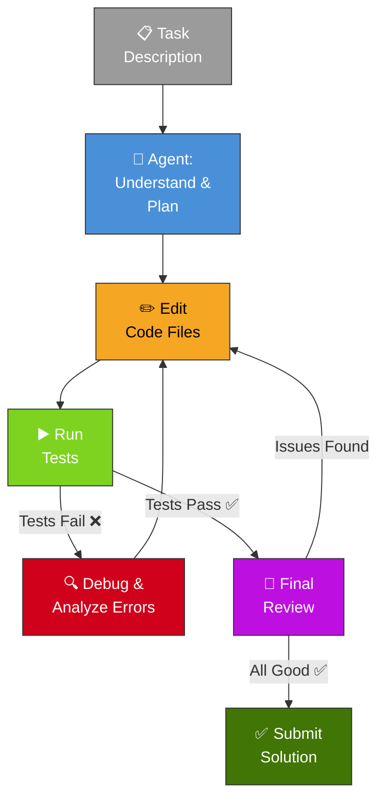
---

## Combining and Customizing These Patterns

These building blocks aren't prescriptive — they're common patterns that developers can shape and combine to fit different use cases. The key to success is **measuring performance and iterating on implementations**. Add complexity only when it demonstrably improves outcomes. 

---

## Summary

Success in the LLM space isn't about building the most sophisticated system — it's about building the **right system** for your needs. 

**Three core principles for implementing agents:**

1. **Maintain simplicity** in your agent's design
2. **Prioritize transparency** by explicitly showing the agent's planning steps
3. **Carefully craft your agent-computer interface (ACI)** through thorough tool documentation and testing

---

## Appendix 1: Agents in Practice

### A. Customer Support

A natural fit for open-ended agents because support interactions follow a conversation flow while requiring access to external information/actions. Tools pull customer data, order history, knowledge base articles; actions like refunds or ticket updates are handled programmatically; success is clearly measurable. 

### B. Coding Agents

Particularly effective because code solutions are verifiable through automated tests, agents can iterate using test results as feedback, the problem space is well-defined, and output quality can be measured objectively. 

---

## Appendix 2: Prompt Engineering Your Tools

Tool definitions deserve as much prompt engineering attention as your overall prompts. Key suggestions: 

- **Give the model enough tokens to "think"** before it writes itself into a corner
- **Keep the format close to what the model has seen naturally** in internet text
- **Minimize formatting overhead** (e.g., don't require accurate line counts or excessive escaping)
- **Invest in Agent-Computer Interfaces (ACI)** as much as you would in Human-Computer Interfaces (HCI):
    - Put yourself in the model's shoes — is tool usage obvious from the description?
    - Include example usage, edge cases, input format requirements, and clear boundaries
    - Test extensively and iterate on tool definitions
    - **Poka-yoke your tools** — make it harder to make mistakes (e.g., require absolute filepaths instead of relative ones)

---

## Single-Agent System with Agent Skills — Architecture Overview

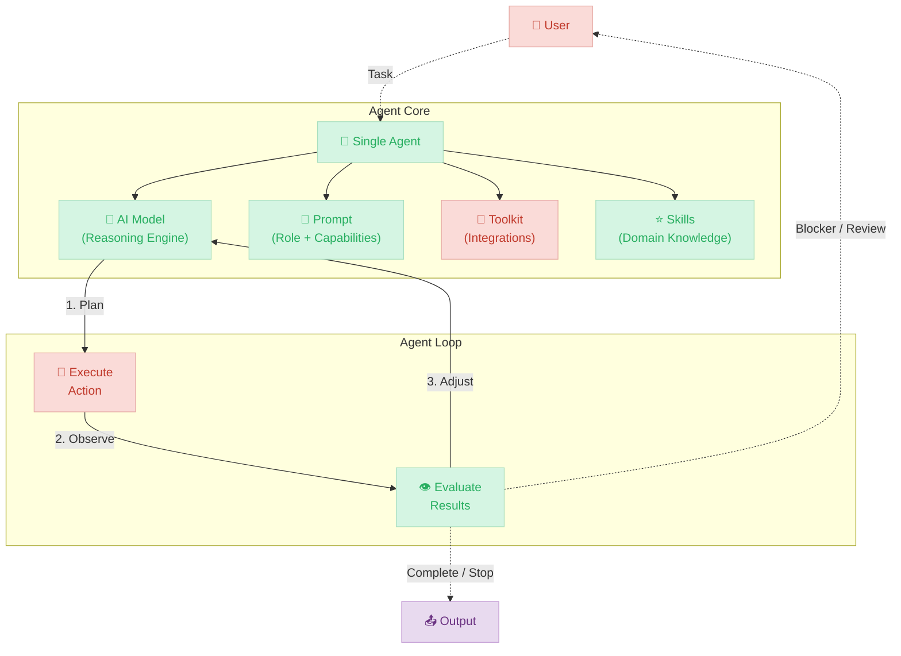

### Sequence Diagram of an example Single Agent System

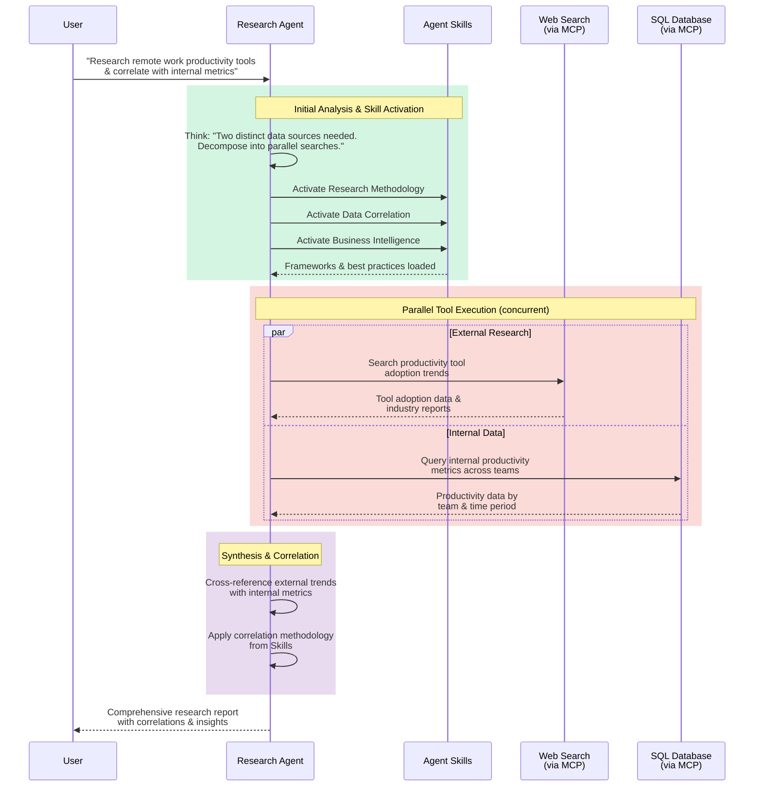

---

## Agent Skills - Composable Architecture 

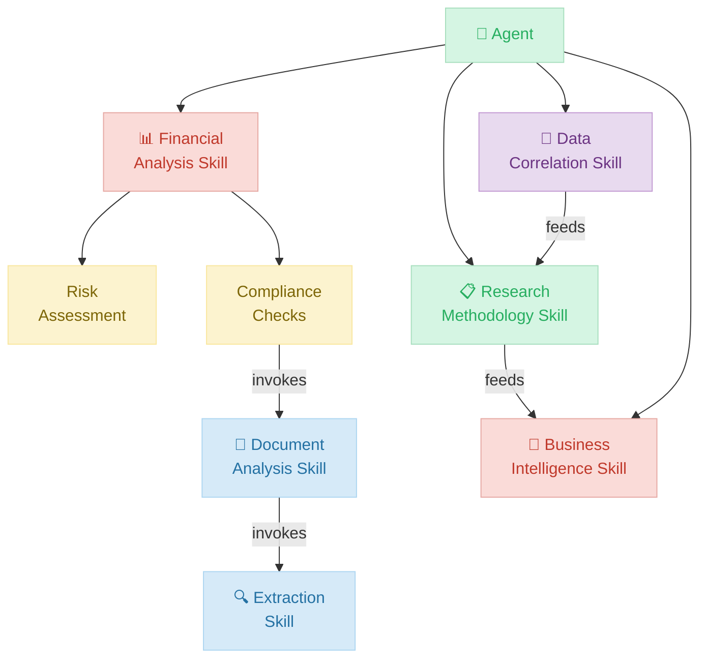

---
