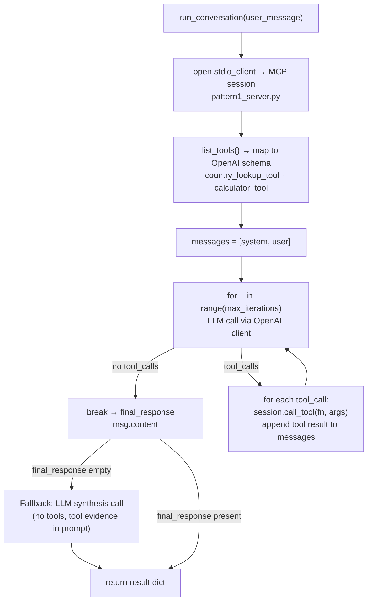
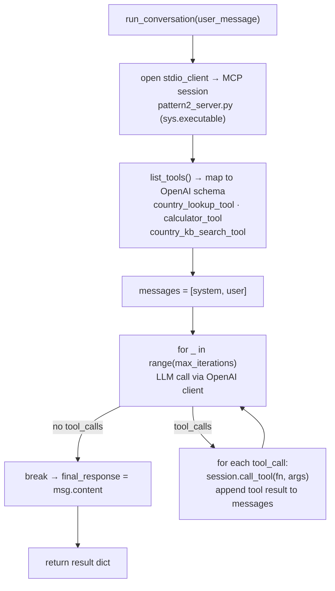
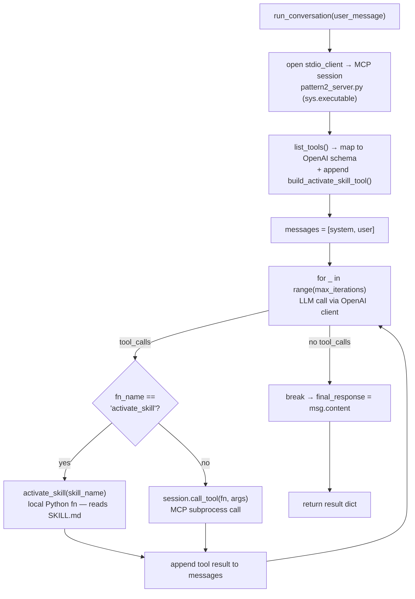
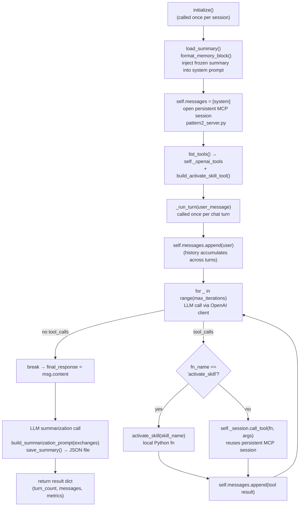

**1) Pattern 1 — explicit `for` loop, MCP opened per call**



```python
# ── Real hermes-agent library ──────────────────────────────────────────────
from run_agent import AIAgent

# MCP servers registered via config/env; loop, fallback, tool dispatch all internal
agent = AIAgent(model="hermes3", max_iterations=10)
result = agent.run_conversation(user_message="What is India's population?")
print(result["final_response"])
```

```python
# ── Hermes-like (this codebase) ────────────────────────────────────────────
# MCP session opened fresh per run_conversation() call — wired manually
async with stdio_client(StdioServerParameters(command="python", args=[str(_MCP_SERVER_PATH)])) as (read, write):
    async with ClientSession(read, write) as session:
        mcp_tools = (await session.list_tools()).tools
        openai_tools = [{"type": "function", "function": {"name": t.name, ...}} for t in mcp_tools]

        for _ in range(self.max_iterations):                     # explicit Python loop
            response = self._client.chat.completions.create(
                model=self.model, messages=messages, tools=openai_tools)
            msg = response.choices[0].message
            if not msg.tool_calls:
                break                                            # model done — exit loop
            for tc in msg.tool_calls:
                result = await session.call_tool(tc.function.name, args)
                messages.append({"role": "tool", "content": result_text})

# Fallback: if loop never produced text, synthesise from tool evidence
if not final_response.strip() and tool_calls_detail:
    fallback_resp = self._client.chat.completions.create(
        model=self.model, messages=[{"role": "user", "content": fallback_prompt}])
```

---

**2) Pattern 2 — same loop, RAG tool added via MCP**



```python
# ── Real hermes-agent library ──────────────────────────────────────────────
from run_agent import AIAgent

# RAG is just another registered MCP server — same run_conversation() call;
# library discovers tools and routes calls internally
agent = AIAgent(model="hermes3", mcp_servers=["country_lookup", "calculator", "country_kb_search"])
result = agent.run_conversation(user_message="Find countries with high GDP per capita")
print(result["final_response"])
```

```python
# ── Hermes-like (this codebase) ────────────────────────────────────────────
# sys.executable ensures the venv with pymilvus/sentence-transformers is used
async with stdio_client(
    StdioServerParameters(command=sys.executable, args=[str(_MCP_SERVER_PATH)])   # pattern2_server.py
) as (read, write):
    ...
    mcp_tools = (await session.list_tools()).tools
    # pattern2_server exposes 3 tools — loop body is identical to P1
    # country_kb_search_tool performs Milvus vector search under the hood
```

---

**3) Pattern 3 — loop with a local/MCP branch for skill calls**



```python
# ── Real hermes-agent library ──────────────────────────────────────────────
from run_agent import AIAgent

# Skills auto-loaded from ~/.hermes/skills/; agent discovers, invokes, and
# writes/improves skill files itself — no manual if/else branch needed
agent = AIAgent(model="hermes3", skills_dir="~/.hermes/skills/")
result = agent.run_conversation(user_message="Compare India and China economically")
# library routes activate_skill calls internally; updated SKILL.md written back
```

```python
# ── Hermes-like (this codebase) ────────────────────────────────────────────
# activate_skill is a local Python function — NOT an MCP tool
# Manual if/else branch required because the real library handles this internally
openai_tools = [...mcp_tools...]
openai_tools.append(build_activate_skill_tool())   # schema only; dispatch is manual

for tool_call in msg.tool_calls:
    fn_name = tool_call.function.name
    if fn_name == "activate_skill":                 # handled locally
        skill_text = activate_skill(fn_args["skill_name"])   # reads _shared/skills/<name>/SKILL.md
        result_text = format_activate_skill_result(skill_name, skill_text)
    else:                                           # everything else → MCP subprocess
        mcp_result = await session.call_tool(fn_name, fn_args)
        result_text = "".join(item.text for item in mcp_result.content if hasattr(item, "text"))
```

---

**4) Pattern 4 — persistent session + growing message list across turns**



```python
# ── Real hermes-agent library ──────────────────────────────────────────────
from run_agent import AIAgent

# 3-layer memory (Honcho user modeling + SQLite FTS5 session search +
# MEMORY.md/SOUL.md procedural memory) handled entirely by the library.
# skip_memory=False enables it; no manual load/save calls needed.
agent = AIAgent(model="hermes3", skip_memory=False)
agent.chat("What countries did we discuss last session?")  # auto-recalls via Honcho
agent.chat("Compare their GDP growth rates")               # maintains full context
```

```python
# ── Hermes-like (this codebase) ────────────────────────────────────────────
# Manual 2-layer memory: flat session.json + rolling LLM summary
# (no Honcho, no FTS5, no procedural MEMORY.md)

# --- Session init (once) ---
self._summary_data = load_summary()                          # reads session.json from disk
system_prompt = self.system_prompt_template.format(
    memory_block=format_memory_block(self._summary_data))    # inject past summary at top
self.messages = [{"role": "system", "content": system_prompt}]

# MCP session kept open across turns (not opened per call like P1–P3)
read, write = await self._stdio_cm.__aenter__()
self._session = await self._mcp_session_cm.__aenter__()

# --- Each turn ---
self.messages.append({"role": "user", "content": user_message})   # history grows
for _ in range(self.max_iterations):
    response = self._client.chat.completions.create(
        model=self.model, messages=self.messages, tools=self._openai_tools)
    if not msg.tool_calls:
        break
    # tool dispatch: local activate_skill OR self._session.call_tool (reused connection)

# --- After turn: compress history into a rolling summary ---
summary_prompt = build_summarization_prompt(self._exchanges)
summary_response = self._client.chat.completions.create(model=self.model, messages=[...])
save_summary(summary_response.choices[0].message.content, self.turn_count)  # writes session.json
```

The key architectural contrast across all four Hermes agents vs. LangGraph:

| | LangGraph | Hermes-like |
|---|---|---|
| Loop mechanism | Compiled `StateGraph` conditional edge | Plain `for _ in range(max_iterations)` |
| Exit condition | `should_continue()` routing function | `if not msg.tool_calls: break` |
| Tool dispatch | Framework `ToolNode` | Manual `for tc in msg.tool_calls` |
| Skill calls | Same `ToolNode` (local fn wrapped as `@tool`) | Explicit `if fn_name == "activate_skill"` branch |
| MCP session | New per `agent.ainvoke()` | P1–P3: new per call; P4: persistent singleton |
| In-session history | `MemorySaver` checkpointer | `self.messages` list appended directly |
| Cross-session memory | LLM summary injected at graph creation | LLM summary injected at `initialize()` |


---

| Feature                | "Hermes-like" (implemented here)        | Real `hermes-agent`                                       |
| ---------------------- | --------------------------------------- | --------------------------------------------------------- |
| **Memory layer 1**     | Flat `session.json`                     | Honcho (user modeling, persona tracking)                  |
| **Memory layer 2**     | Rolling LLM summary                     | SQLite **FTS5** session search                            |
| **Memory layer 3**     | —                                       | Procedural `MEMORY.md` + `SOUL.md`                        |
| **Skill activation**   | Manual `if fn_name == "activate_skill"` | Auto-discovery from `~/.hermes/skills/`                   |
| **Skill writing**      | Read-only                               | Agent can **write/update** SKILL.md itself                |
| **History management** | Full append                             | Honcho compression + FTS retrieval per turn               |
| **Tool routing**       | Manual dispatch                         | Library-managed                                           |
| **System prompt**      | Static template                         | Built dynamically from MEMORY.md + retrieved Honcho facts |
