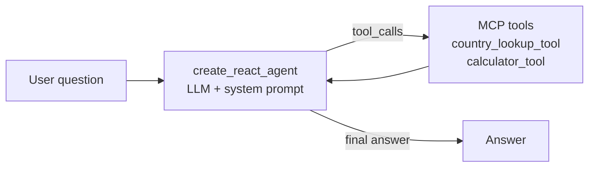
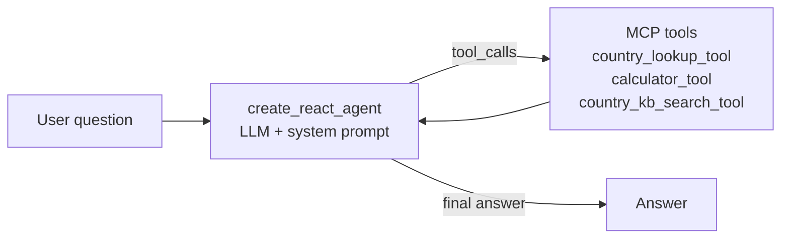
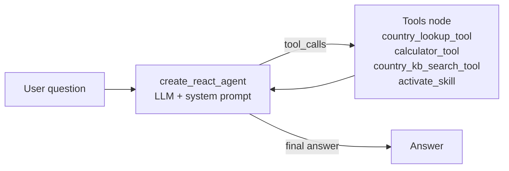
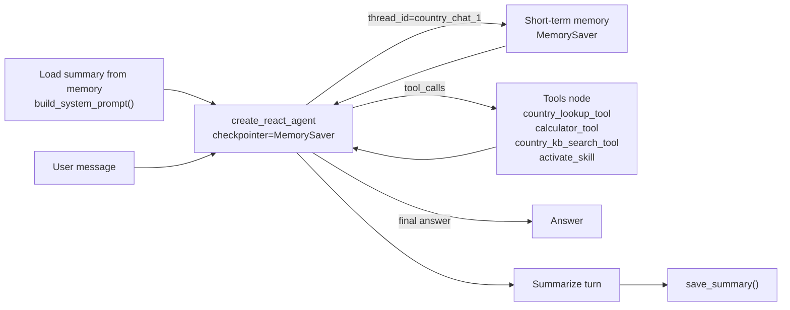
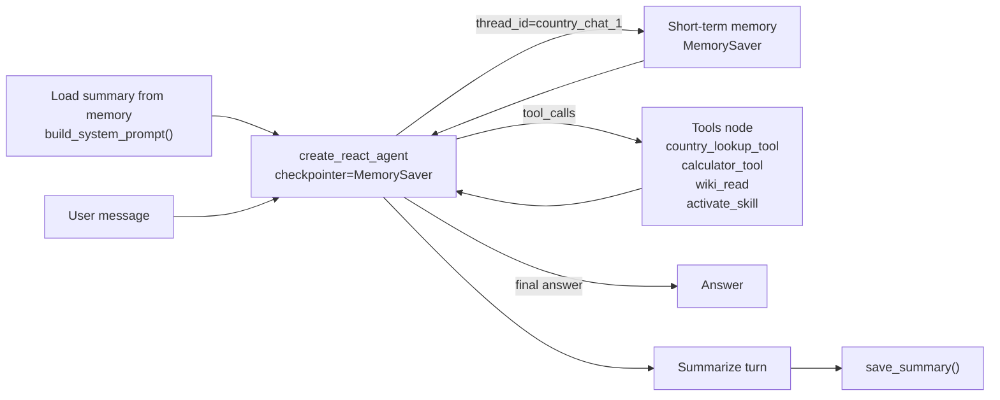

# 🧩 LangGraph 4+1 Patterns — Diagrams + Code Snippets


## 1) Pattern 1: Multiple MCP Tools

`langgraph/agents/1_agent_with_multiple_mcp_tools/src/agent.py`



```python
from langchain_mcp_adapters.client import MultiServerMCPClient
from langchain_ollama import ChatOllama
from langgraph.prebuilt import create_react_agent

# 1. Connect to MCP server, fetch tools
mcp_client = MultiServerMCPClient({
    "country_server": {
        "command": "python",
        "args": ["mcp_servers/country_server.py"],
        "transport": "stdio",
    }
})
tools = await mcp_client.get_tools()   # → [country_lookup_tool, calculator_tool]

# 2. Compile the ReAct agent
llm = ChatOllama(model="qwen3.5:35b-a3b-coding-nvfp4", temperature=0)
agent = create_react_agent(
    model=llm,
    tools=tools,
    prompt="You are a country information assistant. Use tools when needed.",
)

# 3. Run
result = await agent.ainvoke({"messages": [("user", "Population of Japan?")]})
```

> 🎯 **Pattern essence:** Pure ReAct loop. Agent ↔ Tools until model stops calling tools.

***

## 2) Pattern 2: RAG + MCP Tools

`langgraph/agents/2_agent_with_rag_mcp_tool/src/agent.py`



```python
# Only diff vs Pattern 1: MCP server now exposes a RAG tool too.
mcp_client = MultiServerMCPClient({
    "country_server": {
        "command": "python",
        "args": ["mcp_servers/country_server_with_rag.py"],
        "transport": "stdio",
    }
})
tools = await mcp_client.get_tools()
# → [country_lookup_tool, calculator_tool, country_kb_search_tool]

agent = create_react_agent(
    model=llm,
    tools=tools,
    prompt=(
        "You are a country information assistant. "
        "Use country_kb_search_tool for qualitative questions "
        "(culture, history, geography)."
    ),
)
```

> 🎯 **Pattern essence:** Same ReAct skeleton — the LLM now *chooses* between structured lookup and semantic retrieval.

***

## 3) Pattern 3: MCP Tools + Skill Activation

`langgraph/agents/3_agent_with_mcp_tools_and_skills/src/agent.py`



```python
from langchain_core.tools import tool
from pathlib import Path

# 1. Define a skill-activation tool (skills = lightweight md playbooks)
SKILLS_DIR = Path("skills")

@tool
def activate_skill(skill_name: str) -> str:
    """Load a skill playbook by name (e.g., 'compare_countries', 'gdp_per_capita')."""
    skill_path = SKILLS_DIR / f"{skill_name}.md"
    if not skill_path.exists():
        return f"Skill '{skill_name}' not found. Available: {[p.stem for p in SKILLS_DIR.glob('*.md')]}"
    return skill_path.read_text()

# 2. Compose MCP tools + skill tool
mcp_tools = await mcp_client.get_tools()
tools = mcp_tools + [activate_skill]

agent = create_react_agent(
    model=llm,
    tools=tools,
    prompt=(
        "You are a country information assistant. "
        "When a task matches a known skill, FIRST call activate_skill "
        "to load its playbook, then follow it."
    ),
)
```

> 🎯 **Pattern essence:** The agent *bootstraps its own procedure* by calling `activate_skill` before doing work — runtime-loaded instructions.

***

## 4) Pattern 4: Memory + Skills + RAG (Multi-Turn Chat)

`langgraph/agents/4_agent_with_memory_and_chat/src/agent.py`



```python
from langgraph.checkpoint.memory import MemorySaver
import json
from pathlib import Path

SUMMARY_FILE = Path(".memory/country_chat_1_summary.json")

# 1. Long-term summary: load + save helpers
def load_summary() -> str:
    if SUMMARY_FILE.exists():
        return json.loads(SUMMARY_FILE.read_text()).get("summary", "")
    return ""

def save_summary(summary: str) -> None:
    SUMMARY_FILE.parent.mkdir(exist_ok=True)
    SUMMARY_FILE.write_text(json.dumps({"summary": summary}))

# 2. System prompt is rebuilt every turn with the running summary
def build_system_prompt() -> str:
    base = "You are a country info assistant. Use skills + tools as needed."
    summary = load_summary()
    return f"{base}\n\nConversation so far:\n{summary}" if summary else base

# 3. Short-term memory: LangGraph's MemorySaver keeps the message window
checkpointer = MemorySaver()
agent = create_react_agent(
    model=llm,
    tools=mcp_tools + [activate_skill],
    prompt=build_system_prompt(),
    checkpointer=checkpointer,
)

# 4. Per-turn loop: invoke → summarize → persist
config = {"configurable": {"thread_id": "country_chat_1"}}
result = await agent.ainvoke({"messages": [("user", user_msg)]}, config=config)

# 5. Summarize the new turn and append to long-term store
summary_prompt = f"Update this running summary with the latest turn:\n\n{load_summary()}\n\nNew turn:\n{user_msg}\n{result['messages'][-1].content}"
new_summary = (await llm.ainvoke(summary_prompt)).content
save_summary(new_summary)
```

> 🎯 **Pattern essence:** Two memory layers wrap the same ReAct graph — **MemorySaver inside** (recent messages), **summary file outside** (compressed history). The graph itself stays unchanged.

***

## 5) Pattern 5: Memory + Skills + `wiki_read` (No RAG)

`langgraph/agents/5_agent_with_memory_and_chat_no_rag/src/agent.py`



```python
from langchain_core.tools import tool
from pathlib import Path

WIKI_DIR = Path("country_wiki")   # pre-compiled markdown briefs, one per country

# 1. Replace RAG with a deterministic file-read tool (Karpathy-style LLM Wiki)
@tool
def wiki_read(country: str) -> str:
    """Read the pre-compiled wiki brief for a country (no embeddings, no vector DB)."""
    path = WIKI_DIR / f"{country.lower()}.md"
    if not path.exists():
        available = sorted(p.stem for p in WIKI_DIR.glob("*.md"))
        return f"No wiki for '{country}'. Available: {available}"
    return path.read_text()

# 2. Same memory + skill scaffolding as Pattern 4 — only the retrieval tool changes
tools = [country_lookup_tool, calculator_tool, wiki_read, activate_skill]

agent = create_react_agent(
    model=llm,
    tools=tools,
    prompt=build_system_prompt(),
    checkpointer=MemorySaver(),
)

# Invocation, summarization, persistence: identical to Pattern 4.
```

> 🎯 **Pattern essence:** Swap the **retrieval mechanism**, not the agent. Embeddings/vector DB → pre-authored markdown wiki. Deterministic, debuggable, zero infra.

***

## 🔑 Key Pattern Across All Five

The key pattern is the same in every case: **LangGraph compiles a loop where the agent node decides whether to call tools, the tools node executes them, and the graph returns to the agent until the model stops requesting tools.** In Patterns 4 and 5, `MemorySaver` and the summary pipeline sit *around* that graph, not inside it.

```python
# The skeleton that's identical across all 5 patterns
agent = create_react_agent(
    model=llm,
    tools=tools,            # ← what changes (P1→P5)
    prompt=system_prompt,   # ← what changes (P4, P5: dynamic w/ summary)
    checkpointer=memory,    # ← what changes (P4, P5 only)
)
```

| Pattern | `tools` delta     | `prompt` delta              | `checkpointer`  |
| ------- | ----------------- | --------------------------- | --------------- |
| **P1**  | 2 MCP tools       | static                      | —               |
| **P2**  | +RAG tool         | static                      | —               |
| **P3**  | +`activate_skill` | static                      | —               |
| **P4**  | same as P3        | **dynamic** (loads summary) | **MemorySaver** |
| **P5**  | RAG → `wiki_read` | dynamic                     | MemorySaver     |

***

Disclaimer: This is LLM-generated
