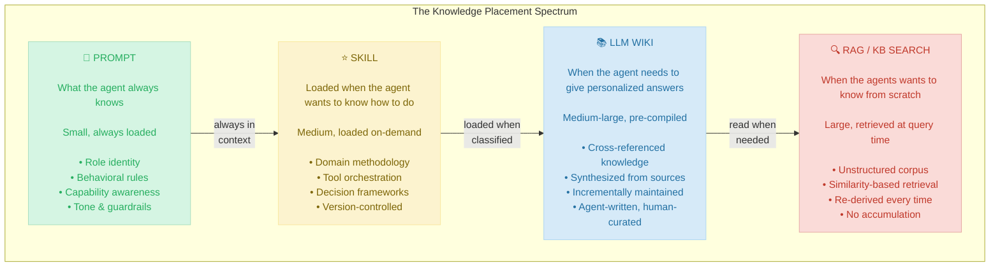
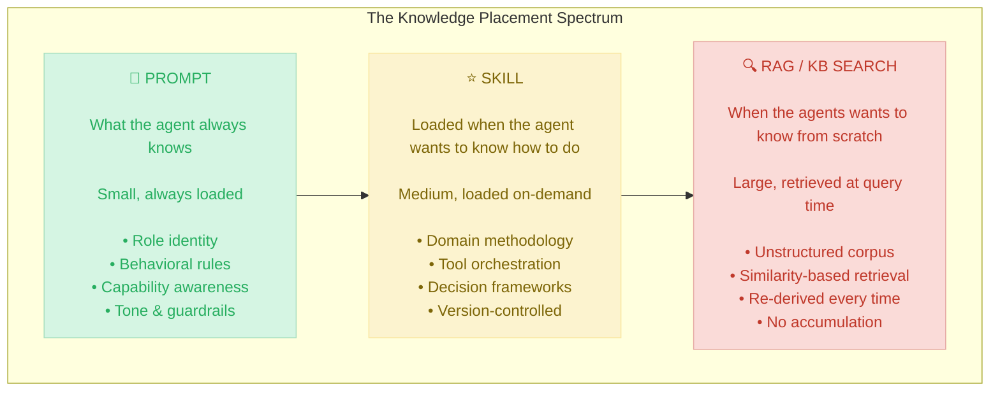

# Prompts vs Skills

| Dimension           | Prompt                 | Skill                                            | LLM Wiki                              | RAG                           |
| ------------------- | ---------------------- | ------------------------------------------------ | ------------------------------------- | ----------------------------- |
| **Size**            | ~200–500 tokens        | ~1K–5K tokens per skill                          | ~10K–100K tokens (whole wiki)         | Unbounded corpus              |
| **When loaded**     | Always                 | On classification match                          | Agent reads relevant pages            | At query time (similarity)    |
| **Who writes it**   | Human (you)            | Human (you)                                      | **Agent writes it**, human curates    | Raw source docs               |
| **Structure**       | Free-form instructions | Structured: context + instructions + constraints | Interlinked markdown pages with index | Chunks in vector DB           |
| **Versioned?**      | Implicitly (in code)   | ✅ Semver per skill                               | ✅ Git-tracked `.md` files             | ❌ Embeddings drift silently   |
| **Accumulates?**    | No                     | No (static until updated)                        | **Yes — compounds over time**         | No (re-derives every query)   |
| **What it answers** | _"Who are you?"_       | _"How do you handle THIS task?"_                 | _"What do you know about X?"_         | _"Find me something about X"_ |

---

# Prompts vs Skills vs Tools 

| Dimension           | Prompt                 | Skill                                            | RAG                           |
| ------------------- | ---------------------- | ------------------------------------------------ | ----------------------------- |
| **Size**            | ~200–500 tokens        | ~1K–5K tokens per skill                          | Unbounded corpus              |
| **When loaded**     | Always                 | On classification match                          | At query time (similarity)    |
| **Who writes it**   | Human (you)            | Human (you)                                      | Raw source docs               |
| **Structure**       | Free-form instructions | Structured: context + instructions + constraints | Chunks in vector DB           |
| **Versioned?**      | Implicitly (in code)   | ✅ Semver per skill                               | ❌ Embeddings drift silently   |
| **Accumulates?**    | No                     | No (static until updated)                        | No (re-derives every query)   |
| **What it answers** | _"Who are you?"_       | _"How do you handle THIS task?"_                 | _"Find me something about X"_ |

