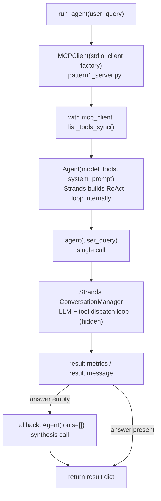
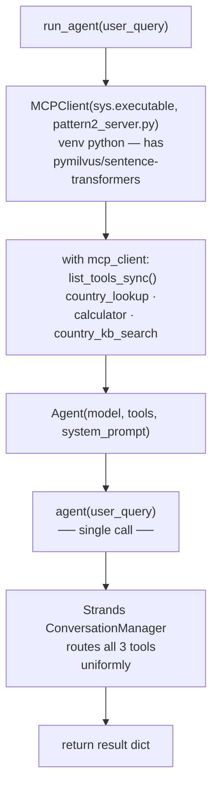
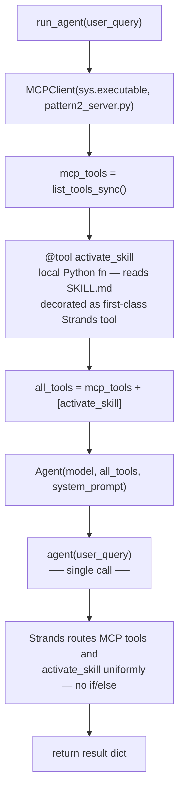
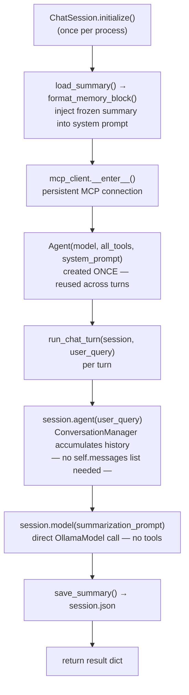

**1) Pattern 1 — Agent wraps the loop; MCP opened via context manager**



```python
# callback_handler=None suppresses streaming; answer extracted from nested
# result.message["content"] list; fallback synthesis Agent for empty answers
with mcp_client:
    agent = Agent(model=model, tools=mcp_client.list_tools_sync(),
                  system_prompt=SYSTEM_PROMPT, callback_handler=None)
    result = agent(user_query)
    answer = _extract_answer(result)    # walks result.message["content"] list

    if not answer.strip() and tool_calls_detail:
        # Fallback: new tool-free Agent to synthesise from tool evidence
        synthesis_agent = Agent(model=model, tools=[], system_prompt="...", callback_handler=None)
        answer = _extract_answer(synthesis_agent(fallback_prompt))
        llm_calls += 1
```

---

**2) Pattern 2 — same Agent call; sys.executable for venv-compat MCP launch**



```python
# sys.executable (not "python") so the .venv with pymilvus/sentence-transformers is used
mcp_client = MCPClient(lambda: stdio_client(
    StdioServerParameters(command=sys.executable, args=[str(_MCP_SERVER_PATH)])))
# loop body identical to P1; country_kb_search_tool performs Milvus vector search
```

---

**3) Pattern 3 — `@tool` decorator unifies local fn + MCP; no dispatch branch**



```python
# @tool-decorated local fn joins MCP tools as a peer — Strands dispatches both
# contrast with Hermes P3 which needed an explicit if fn_name == "activate_skill" branch
with mcp_client:
    mcp_tools = mcp_client.list_tools_sync()
    all_tools = mcp_tools + [activate_skill]           # activate_skill is @tool decorated
    agent = Agent(model=model, tools=all_tools, system_prompt=SYSTEM_PROMPT, callback_handler=None)
    result = agent(user_query)
    skill_activations = tools_used.count("activate_skill")   # counted post-hoc from metrics
```

---

**4) Pattern 4 — reused Agent = free short-term memory; explicit long-term summary**



```python
# --- Session init (once) ---
summary_data = load_summary()                                   # reads session.json
system_prompt = build_system_prompt(format_memory_block(summary_data))
self.mcp_client.__enter__()                                     # persistent MCP connection
mcp_tools = self.mcp_client.list_tools_sync()
self.agent = Agent(model=self.model, tools=mcp_tools + [activate_skill],
                   system_prompt=system_prompt)                 # created once

# --- Each turn ---
# Agent reuse = short-term memory for free via Strands ConversationManager
# (contrast with Hermes P4 which manually appends to self.messages each turn)
result = session.agent(user_query)

# --- After turn: manual LLM summarization for cross-session persistence ---
# Strands has no built-in cross-session memory — this part is always manual
summary_result = session.model(summarization_prompt)   # OllamaModel called directly
save_summary(_extract_answer(summary_result), session.turn_count)   # writes session.json
```
