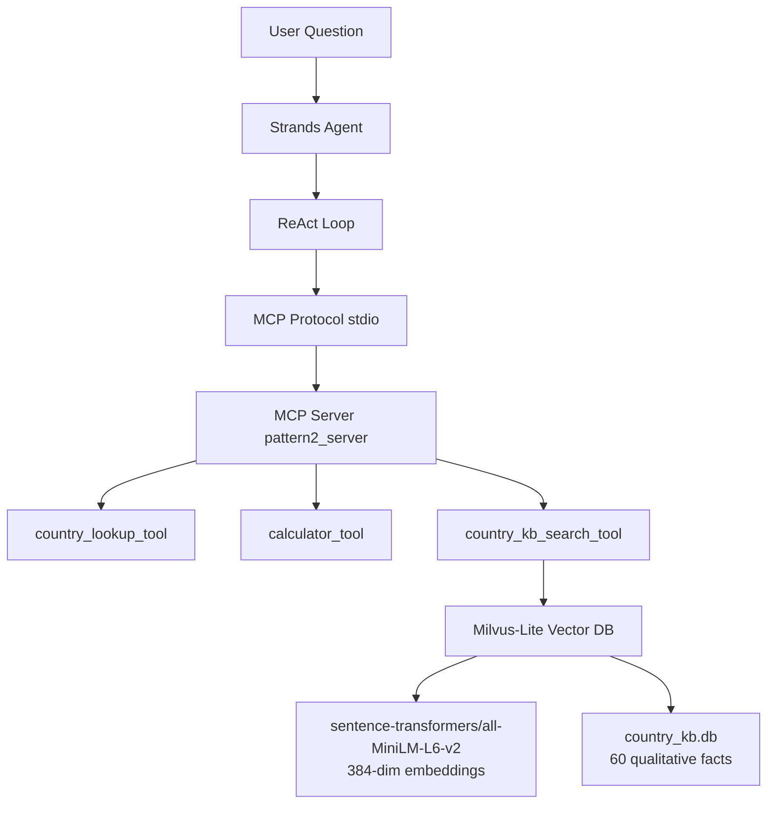

# Pattern 2: Agent with RAG MCP Tool

**Building on P1** — Adds semantic search over a knowledge base, enabling the agent to answer qualitative questions.

## What's New in Pattern 2

| Feature | P1 | P2 |
|---------|----|----|
| MCP Tools | 2 | **3** (+RAG) |
| Quantitative answers | ✅ | ✅ |
| Qualitative answers | ❌ | **✅** |
| Vector database | ❌ | **✅ Milvus-Lite** |

> **P2 Metaphor:** The agent has **hands and eyes** (tools + retrieval).

## Overview

Pattern 2 extends Pattern 1 by adding a **RAG (Retrieval-Augmented Generation)** tool that searches a vector database of country facts. This allows the agent to answer questions about culture, history, geography, and other qualitative aspects that are not in the structured JSON data.

## Architecture



```
┌─────────────────────────────────────────────────────────┐
│                    Strands Agent                        │
│  ┌─────────────────────────────────────────────────────┐│
│  │              ReAct Loop (LLM)                       ││
│  │   Question → Reason → Act → Observe → Repeat       ││
│  └─────────────────────────────────────────────────────┘│
│                          │                              │
│                    MCP Protocol (stdio)                 │
│                          ▼                              │
│  ┌─────────────────────────────────────────────────────┐│
│  │              MCP Server (pattern2_server)           ││
│  │  ┌───────────┐ ┌──────────┐ ┌─────────────────┐    ││
│  │  │ country_  │ │calculator│ │ country_kb_     │    ││
│  │  │ lookup    │ │ _tool    │ │ search_tool     │    ││
│  │  └───────────┘ └──────────┘ └────────┬────────┘    ││
│  └──────────────────────────────────────│──────────────┘│
│                                         │               │
│                                         ▼               │
│  ┌─────────────────────────────────────────────────────┐│
│  │              Milvus-Lite Vector DB                  ││
│  │  sentence-transformers/all-MiniLM-L6-v2 (384-dim)  ││
│  │  country_kb.db (60 qualitative facts)               ││
│  └─────────────────────────────────────────────────────┘│
└─────────────────────────────────────────────────────────┘
```

## Available Tools

| Tool | Purpose | New in P2? |
|------|---------|------------|
| `country_lookup_tool` | Get GDP, population, or area | ❌ (from P1) |
| `calculator_tool` | Evaluate math expressions | ❌ (from P1) |
| `country_kb_search_tool` | Semantic search over country facts | **✅ NEW** |

### The RAG Tool

```python
country_kb_search_tool(query="What makes Japan unique?", top_k=3)
# Returns:
# [Japan] (relevance: 0.420) Japan has the third-largest economy globally...
# [Japan] (relevance: 0.385) Japan has the oldest population in the world...
```

## Usage

```bash
cd strands/agents/2_agent_with_rag_mcp_tool
uv sync
uv run python -m src.main --question "What is unique about Brazil's environment?"
```

### Run Experiments
```bash
bash experiments.bash
```

## Directory Structure

```
2_agent_with_rag_mcp_tool/
├── src/
│   ├── __init__.py
│   ├── agent.py         # ReAct agent with MCP client
│   ├── prompts.py       # Updated prompt mentioning kb_search
│   └── main.py          # CLI entry point
├── experiments.bash     # Automated experiment runner
├── logs.txt             # Experiment results
└── pyproject.toml
```

## Example Output

**Question:** "What is unique about Brazil's environment?"

```json
{
    "answer": "Brazil contains approximately 60% of the Amazon rainforest, the world's largest tropical forest and a critical carbon sink. It also has the most biodiversity of any country on Earth.",
    "framework": "strands",
    "pattern": "agent_with_rag_mcp_tool",
    "llm_calls": 2,
    "total_duration_ms": 12340,
    "tool_calls": 1,
    "tools_used": ["country_kb_search_tool"]
}
```

## RAG Implementation Details

- **Embedding Model:** `sentence-transformers/all-MiniLM-L6-v2` (384 dimensions)
- **Vector DB:** Milvus-Lite (file-based at `_shared/vector_db/country_kb.db`)
- **Index Type:** FLAT (exact search, suitable for small datasets)
- **Knowledge Base:** 60 qualitative facts across 20 countries (3 facts each)

### Knowledge Base Topics
- Economy and industry
- Demographics and culture
- Geography and environment
- Government and politics
- Historical significance

## Capabilities & Limitations

### ✅ What Pattern 2 Can Do (New)
- Answer qualitative questions about countries
- Combine quantitative data with qualitative context
- Semantic search (not just keyword matching)

### ✅ What Pattern 2 Keeps from P1
- Answer quantitative questions
- Perform calculations
- Chain multiple tool calls

### ❌ What Pattern 2 Cannot Do
- Follow structured analysis methodologies
- Remember previous conversations
- Produce consistent output formats

## What's Next

**Pattern 3** adds a **skills layer** — reusable analysis methodologies that guide the agent through structured workflows like country comparisons, regional analysis, and report formatting.

---

## Progression Summary

| Pattern | Tools | Skills | Memory | Interface |
|---------|-------|--------|--------|-----------|
| P1 | 2 MCP | ❌ | ❌ | CLI `--question` |
| **P2** | **3 MCP (+RAG)** | ❌ | ❌ | CLI `--question` |
| P3 | 3 MCP | 4 skills | ❌ | CLI `--question` |
| P4 | 3 MCP | 4 skills | ✅ Dual-layer | Interactive chat |
