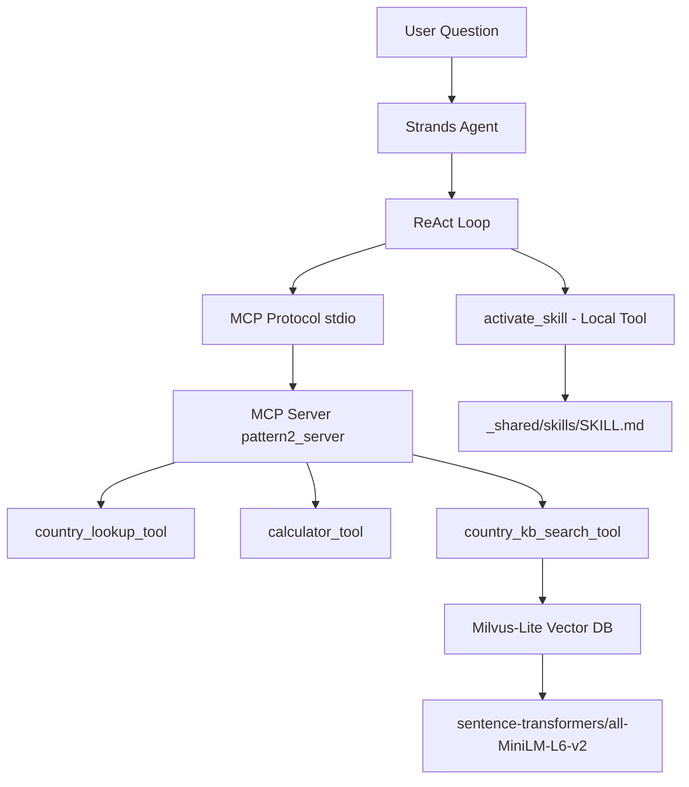

# Pattern 3: Agent with MCP Tools and Skills

**Building on P2** — Adds a skills layer that provides structured analysis methodologies, improving output consistency and quality.

## What's New in Pattern 3

| Feature | P2 | P3 |
|---------|----|----|
| MCP Tools | 3 | 3 (same) |
| Local Tools | 0 | **1** (`activate_skill`) |
| Skills | ❌ | **4 analysis skills** |
| Structured output | ❌ | **✅ Templates** |
| Methodology guidance | ❌ | **✅** |

> **P3 Metaphor:** The agent has **hands, eyes, and a playbook** (tools + retrieval + methodology).

## Overview

Pattern 3 extends Pattern 2 by introducing **skills** — markdown files that contain detailed instructions for specific analysis tasks. When the agent activates a skill, it loads a structured methodology that guides its tool use and output formatting.

This addresses a key limitation of P1/P2: **inconsistent outputs**. Without methodology guidance, the LLM might produce a table one time and bullet points the next. Skills enforce consistent, professional output formats.

## Architecture



```
┌─────────────────────────────────────────────────────────┐
│                    Strands Agent                        │
│  ┌─────────────────────────────────────────────────────┐│
│  │              ReAct Loop (LLM)                       ││
│  │   Question → Activate Skill → Follow Methodology   ││
│  └──────────────────────┬──────────────────────────────┘│
│                         │                                │
│         ┌───────────────┴───────────────┐               │
│         │                               │               │
│         ▼                               ▼               │
│  ┌─────────────┐              ┌─────────────────┐       │
│  │ MCP Server  │              │ Local Tool:     │       │
│  │ (3 tools)   │              │ activate_skill  │       │
│  └─────────────┘              └────────┬────────┘       │
│                                        │                │
│                                        ▼                │
│  ┌─────────────────────────────────────────────────────┐│
│  │              Skills Directory (_shared/skills)      ││
│  │  ┌──────────────┐ ┌──────────────┐                  ││
│  │  │ country-     │ │ country-     │                  ││
│  │  │ comparison   │ │ profile      │                  ││
│  │  └──────────────┘ └──────────────┘                  ││
│  │  ┌──────────────┐ ┌──────────────┐                  ││
│  │  │ regional-    │ │ report-      │                  ││
│  │  │ analysis     │ │ formatting   │                  ││
│  │  └──────────────┘ └──────────────┘                  ││
│  └─────────────────────────────────────────────────────┘│
└─────────────────────────────────────────────────────────┘
```

## Available Tools

| Tool | Purpose | Source |
|------|---------|--------|
| `country_lookup_tool` | Get GDP, population, or area | MCP (from P1) |
| `calculator_tool` | Evaluate math expressions | MCP (from P1) |
| `country_kb_search_tool` | Semantic search over facts | MCP (from P2) |
| `activate_skill` | Load analysis methodology | **Local (NEW)** |

## Available Skills

| Skill | Purpose | Output Format |
|-------|---------|---------------|
| `country-comparison` | Compare 2+ countries systematically | Comparison table + takeaway |
| `country-profile` | Build comprehensive single-country brief | Profile card + key facts |
| `regional-analysis` | Group by region, compute aggregates | Regional summary + rankings |
| `report-formatting` | Format results as professional report | Full markdown report |

### Example Skill: `country-comparison`

```markdown
# Country Comparison Skill

## When to Use
- User asks to compare 2+ countries
- Questions about differences or similarities

## Methodology
1. Identify countries to compare
2. Fetch GDP, population, area for each
3. Calculate derived metrics (GDP per capita, density)
4. Search qualitative facts for context
5. Format as comparison table

## Output Template
| Metric | Country A | Country B |
|--------|-----------|-----------|
| GDP    | $X.XX T   | $Y.YY T   |
...
**Takeaway:** [One key insight from the comparison]
```

## Three-Phase Design

The agent operates in three phases per request:

| Phase | What Happens | Tool |
|-------|-------------|------|
| **1. Skill Discovery** | System prompt lists all skills by name and one-liner | (none — in prompt) |
| **2. Skill Activation** | LLM selects and loads the right skill's full instructions | `activate_skill` |
| **3. Tool Execution** | LLM follows skill steps with MCP tools | `country_lookup_tool`, `calculator_tool`, `country_kb_search_tool` |

## Usage

```bash
cd strands/agents/3_agent_with_mcp_tools_and_skills
uv sync
uv run python -m src.main --task country_analysis --question "Compare Japan and Germany by GDP and population"
```

### Run Experiments
```bash
bash experiments.bash
```

### Override model
```bash
OLLAMA_MODEL=qwen3:8b bash experiments.bash
```

## Directory Structure

```
3_agent_with_mcp_tools_and_skills/
├── src/
│   ├── __init__.py
│   ├── agent.py         # Strands agent + MCP client + activate_skill wiring
│   ├── prompts.py       # System prompt with skills index embedded
│   ├── skill_tools.py   # activate_skill Strands @tool definition
│   └── main.py          # CLI entry point + log appender
├── experiments.bash     # Automated experiment runner (4 skill-targeting runs)
├── logs.txt             # Experiment results (append-only)
├── pyproject.toml       # Local isolated uv environment
└── uv.lock
```

## Strands Framework Integration

### Custom Tool Registration

The `activate_skill` tool is a Python function decorated with Strands `@tool`:

```python
from strands import tool

@tool
def activate_skill(skill_name: str) -> str:
    """Load full instructions for a skill by name."""
    skill_path = SKILLS_DIR / skill_name / "SKILL.md"
    return skill_path.read_text()
```

Strands accepts MCP tools and local `@tool`-decorated functions in the same list:

```python
all_tools = mcp_tools + [activate_skill]  # mix MCP + local
agent = Agent(model=model, tools=all_tools, system_prompt=SYSTEM_PROMPT)
```

## Example Output

**Question:** "Compare Japan and Germany by GDP and population"

```json
{
    "answer": "| Metric | Japan | Germany |\n|--------|-------|---------|\n| GDP | $4.21T | $4.56T |\n| Population | 124.5M | 83.3M |\n| GDP per capita | ~$33,815 | ~$54,742 |\n\n**Takeaway:** Germany has higher GDP per capita despite lower total GDP, reflecting its smaller population.",
    "framework": "strands",
    "pattern": "agent_with_mcp_tools_and_skills",
    "llm_calls": 4,
    "total_duration_ms": 43000,
    "tool_calls": 8,
    "skill_activations": 1,
    "tools_used": ["activate_skill", "country_lookup_tool", "country_lookup_tool", "country_lookup_tool", "country_lookup_tool", "calculator_tool", "calculator_tool", "country_kb_search_tool"]
}
```

## Skills Implementation

Skills are stored as markdown files in `_shared/skills/{skill-name}/SKILL.md`:

```
_shared/skills/
├── country-comparison/SKILL.md
├── country-profile/SKILL.md
├── regional-analysis/SKILL.md
└── report-formatting/SKILL.md
```

The `activate_skill` tool reads and returns the skill file content. The LLM then uses it as methodology guidance for that turn.

## Capabilities & Limitations

### ✅ What Pattern 3 Can Do (New)
- Follow structured analysis methodologies
- Produce consistent, templated outputs
- Handle complex multi-step analyses
- Self-select appropriate skills for tasks

### ✅ What Pattern 3 Keeps from P1/P2
- Quantitative lookups and calculations
- Qualitative knowledge base search
- Tool chaining and reasoning

### ❌ What Pattern 3 Cannot Do
- Remember previous conversations
- Build on prior analysis
- Maintain user preferences across sessions

## What's Next

**Pattern 4** adds **conversation memory** — both short-term (within session) and long-term (across sessions). This enables multi-turn conversations where the agent can reference previous exchanges.

---

## Progression Summary

| Pattern | Tools | Skills | Memory | Interface |
|---------|-------|--------|--------|-----------|
| P1 | 2 MCP | ❌ | ❌ | CLI `--question` |
| P2 | 3 MCP (+RAG) | ❌ | ❌ | CLI `--question` |
| **P3** | 3 MCP + 1 local | **4 skills** | ❌ | CLI `--question` |
| P4 | 3 MCP + 1 local | 4 skills | ✅ Dual-layer | Interactive chat |
